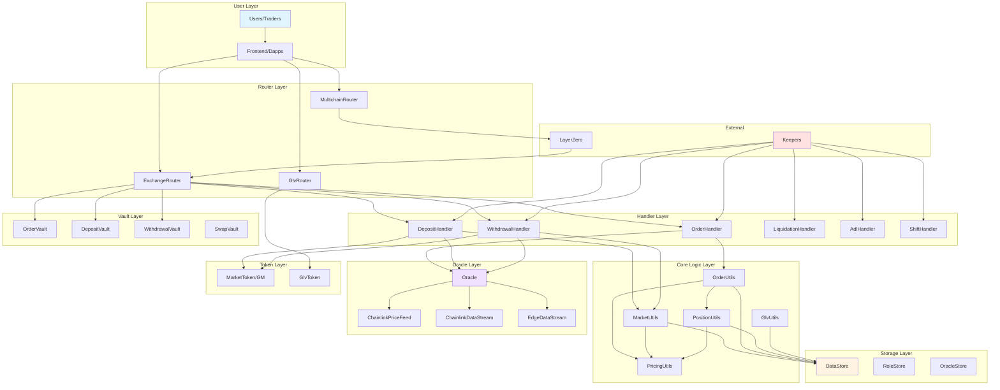
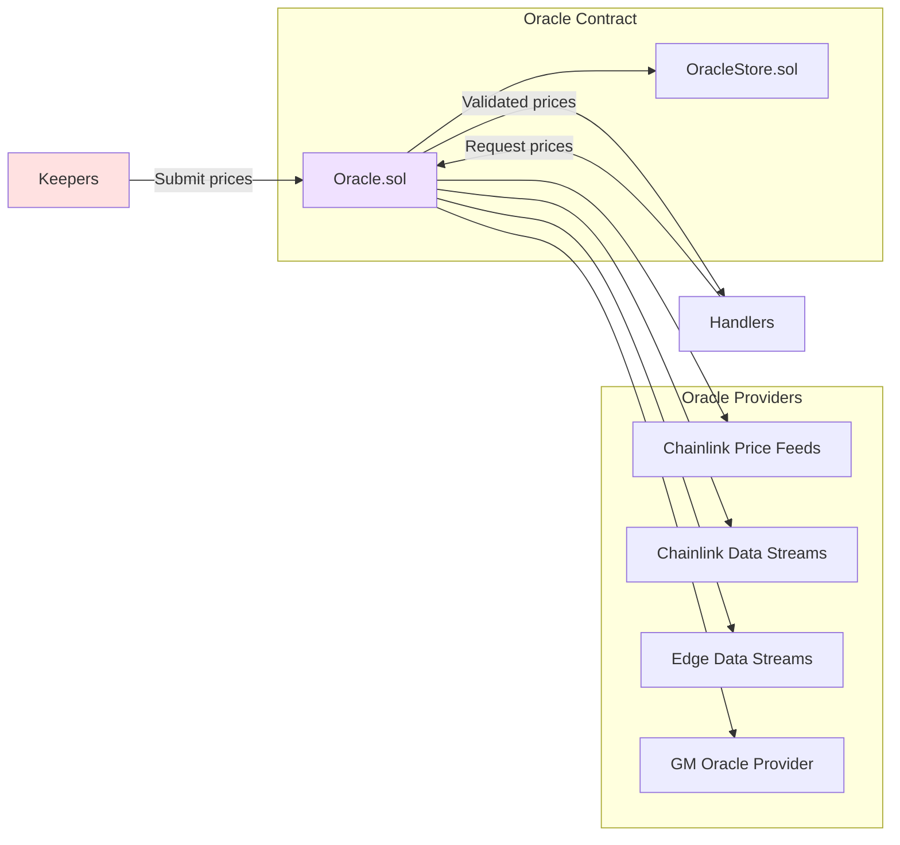

# GMX Synthetics - System Architecture

## Table of Contents
1. [Project Overview](#project-overview)
2. [System Architecture](#system-architecture)
3. [Directory Structure](#directory-structure)
4. [Core Concepts](#core-concepts)
5. [Configuration & Deployment](#configuration--deployment)
6. [Security Considerations](#security-considerations)
7. [Development Guidelines](#development-guidelines)

---

## Project Overview

### Purpose
GMX Synthetics is a decentralized perpetual exchange protocol that supports both spot and perpetual trading with isolated liquidity markets. It represents the next generation of GMX, built with advanced architecture for synthetic asset trading.

### Key Features
- **Perpetual & Spot Trading**: Support for leveraged positions and token swaps
- **Isolated Markets**: Each market has independent risk and liquidity
- **GLV (GMX Liquidity Vault)**: Multi-market liquidity aggregation
- **Advanced Order Types**: Market, limit, stop-loss, take-profit orders
- **Oracle-Based Execution**: Two-step execution model prevents front-running
- **Multichain Support**: LayerZero integration for cross-chain operations
- **Sophisticated Pricing**: Price impact, funding fees, borrowing fees

### Supported Networks
- **Mainnet**: Arbitrum (primary), Avalanche, Botanix
- **Testnet**: Arbitrum Sepolia, Avalanche Fuji

### Code Statistics
- **~309 Solidity contracts** organized into **42 functional modules**
- **~160 deployment scripts** for infrastructure setup
- Comprehensive test coverage across all major features

---

## System Architecture

### High-Level Component Diagram



### Architectural Principles

#### 1. Separation of Concerns
The architecture separates responsibilities into distinct layers:

- **Bank Contracts (Vaults)**: Hold user funds securely
  - `OrderVault.sol`, `DepositVault.sol`, `WithdrawalVault.sol`, `SwapVault.sol`
  - Funds only move in/out through authorized handlers

- **Data Storage**: Centralized key-value storage
  - `DataStore.sol` - Main storage contract using key-value pairs
  - `RoleStore.sol` - Access control storage
  - `OracleStore.sol` - Oracle configuration storage

- **Logic Contracts**: Stateless business logic
  - Handler contracts orchestrate operations
  - Utils libraries contain pure/view functions
  - No fund custody in logic contracts

- **StoreUtils**: Struct serialization/deserialization
  - `MarketStoreUtils.sol`, `PositionStoreUtils.sol`, `OrderStoreUtils.sol`
  - Consistent CRUD operations for all entities
  - EnumerableSet integration for efficient querying

#### 2. Upgradeability Strategy
- **Handler Replacement**: Logic contracts can be upgraded by changing handler addresses in RoleStore
- **Data Persistence**: All critical data stored in DataStore survives upgrades
- **Event Stability**: EventUtils provides flexible event emission that survives ABI changes
- **Backward Compatibility**: New handlers must respect existing data structures

#### 3. Two-Step Execution Model
Prevents front-running and MEV attacks:

```
Step 1 (User): Create request → Store in DataStore → Pay execution fee
Step 2 (Keeper): Execute with oracle prices → Settle funds → Emit event
```

Benefits:
- Users can't be front-run on price
- Oracle prices determine execution
- Keeper competition ensures timely execution
- Execution fees cover gas costs

#### 4. Access Control Architecture
Role-based access control via `RoleStore.sol`:

```solidity
// contracts/role/Role.sol defines roles
bytes32 public constant CONTROLLER = keccak256(abi.encode("CONTROLLER"));
bytes32 public constant ORDER_KEEPER = keccak256(abi.encode("ORDER_KEEPER"));
bytes32 public constant CONFIG_KEEPER = keccak256(abi.encode("CONFIG_KEEPER"));
// ... more roles
```

Critical roles:
- **CONTROLLER**: Admin role, can grant/revoke other roles
- **ORDER_KEEPER**: Executes orders with oracle prices
- **LIQUIDATION_KEEPER**: Executes liquidations
- **CONFIG_KEEPER**: Updates market configurations
- **TIMELOCK_MULTISIG**: Manages configuration changes with timelock
- **ADL_KEEPER**: Executes auto-deleveraging

See `config/roles.ts` for role assignments per network.

#### 5. Struct Organization Pattern
Contracts use nested structs to avoid "Stack too deep" errors:

```solidity
struct Props {
    Addresses addresses;
    Numbers numbers;
    Flags flags;
}

struct Addresses {
    address market;
    address account;
    // ...
}
```

Examples:
- `contracts/order/Order.sol:Props`
- `contracts/position/Position.sol:Props`
- `contracts/market/Market.sol:Props`

#### 6. Event Architecture
`EventUtils.sol` provides generic event emission:

```solidity
EventUtils.EventLog memory eventData = EventUtils.EventLog({
    msgSender: msg.sender,
    eventName: "OrderCreated",
    eventData: abi.encode(order)
});
eventEmitter.emitEventLog2(/* ... */);
```

Benefits:
- Events can change structure without breaking integrations
- Off-chain systems decode based on event name
- Full event history available even after contract upgrades

---

## Directory Structure

### Root Level
```
/
├── contracts/          # 309 Solidity contracts (42 subdirectories)
├── test/              # Comprehensive test suite
├── scripts/           # Deployment and utility scripts
├── deploy/            # ~160 Hardhat-deploy scripts
├── config/            # Configuration files (tokens, markets, GLVs, etc.)
├── utils/             # TypeScript utilities
├── docs/              # Documentation (deployment artifacts)
├── deployments/       # Deployment artifacts per network
├── abis/              # Contract ABIs for frontend
├── audits/            # Security audit reports
├── hardhat.config.ts  # Hardhat configuration
└── package.json       # Dependencies
```

### contracts/ Structure (42 modules)

```
contracts/
├── market/            # Market management
├── order/             # Order system
├── position/          # Position management
├── deposit/           # Liquidity deposits
├── withdrawal/        # Liquidity withdrawals
├── swap/              # Swap logic
├── exchange/          # Main exchange handlers
├── pricing/           # Pricing calculations
├── fee/               # Fee management
├── oracle/            # Oracle system
├── glv/               # GLV vaults
├── glvDeposit/        # GLV deposit operations
├── glvWithdrawal/     # GLV withdrawal operations
├── glvShift/          # GLV rebalancing
├── multichain/        # LayerZero integration
├── liquidation/       # Liquidation logic
├── adl/               # Auto-deleveraging
├── referral/          # Referral system
├── callback/          # Callback interfaces
├── reader/            # Read-only query interfaces
├── router/            # Routing contracts
├── bank/              # Vault contracts
├── data/              # DataStore and Keys
├── role/              # Access control
├── token/             # Token utilities
├── event/             # Event emission
├── config/            # Configuration management
├── gas/               # Gas estimation
├── claim/             # Claimable rewards
├── chain/             # Chain utilities
├── error/             # Custom errors
├── external/          # External interfaces
├── gov/               # Governance contracts
├── migration/         # Migration utilities
├── mock/              # Test mocks
├── nonce/             # Nonce management
├── subaccount/        # Subaccount support
└── utils/             # General utilities
```

### config/ Structure

```
config/
├── tokens.ts          # Token configurations, oracle settings
├── markets.ts         # Market parameters (fees, limits, price impact)
├── glvs.ts           # GLV configurations
├── oracle.ts         # Oracle keeper settings
├── roles.ts          # Role assignments per network
├── chains.ts         # Chain-specific settings
└── layerZero.ts      # LayerZero endpoints
```

### test/ Structure

```
test/
├── exchange/          # Main exchange operation tests
│   ├── DecreasePosition/
│   ├── FundingFees/
│   ├── PositionPriceImpact/
│   └── ...
├── order/             # Order tests
├── position/          # Position tests
├── market/            # Market tests
├── glv/              # GLV tests
├── multichain/        # Cross-chain tests
├── oracle/            # Oracle tests
├── pricing/           # Pricing tests
└── utils/             # Test utilities
```

---

## Core Concepts

### Domain Model

#### Market
A trading venue defined by three tokens:

```solidity
// contracts/market/Market.sol
struct Props {
    Addresses addresses;
    Numbers numbers;
    Flags flags;
}

struct Addresses {
    address marketToken;      // GM token address
    address indexToken;       // Price exposure token
    address longToken;        // Long collateral token
    address shortToken;       // Short collateral token
}
```

**Example Markets:**
- **ETH/USD**: indexToken=WETH, longToken=WETH, shortToken=USDC
- **BTC/USD**: indexToken=WBTC, longToken=WBTC, shortToken=USDC
- **Swap-only**: indexToken=address(0), longToken=USDC, shortToken=USDT

**Market Properties:**
- Each market has isolated risk and liquidity
- LPs deposit collateral tokens, receive MarketToken (GM token)
- Pool balances tracked separately for long and short tokens
- Virtual inventory for cross-market price impact coordination

Key files:
- `contracts/market/Market.sol:34` - Data structure
- `contracts/market/MarketUtils.sol` - Core logic (140KB)
- `contracts/market/MarketStoreUtils.sol` - Storage operations
- `contracts/market/MarketFactory.sol` - Market creation

#### Position
Long or short exposure to an index token:

```solidity
// contracts/position/Position.sol
struct Props {
    Addresses addresses;
    Numbers numbers;
    Flags flags;
}

struct Numbers {
    uint256 sizeInUsd;           // Position size in USD
    uint256 sizeInTokens;        // Position size in index tokens
    uint256 collateralAmount;    // Collateral backing position
    uint256 borrowingFactor;     // Borrowing fee tracking
    uint256 fundingFeeAmountPerSize;  // Funding fee tracking
    uint256 longTokenClaimableFundingAmountPerSize;
    uint256 shortTokenClaimableFundingAmountPerSize;
    uint256 increasedAtBlock;
    uint256 decreasedAtBlock;
}
```

**Position Mechanics:**
- Collateral provided in either long or short token
- Size determines leverage: leverage = sizeInUsd / (collateralAmount * price)
- Accumulates borrowing fees based on pool utilization
- Accumulates funding fees based on long/short imbalance
- Subject to liquidation if collateral insufficient

Key files:
- `contracts/position/Position.sol:29` - Data structure
- `contracts/position/PositionUtils.sol` - Core calculations
- `contracts/position/IncreasePositionUtils.sol` - Opening positions
- `contracts/position/DecreasePositionUtils.sol` - Closing positions
- `contracts/position/DecreasePositionCollateralUtils.sol` - Collateral management
- `contracts/position/DecreasePositionSwapUtils.sol` - Position decrease with swaps

#### Order
Request for a trading operation:

```solidity
// contracts/order/Order.sol
enum OrderType {
    MarketSwap,
    LimitSwap,
    MarketIncrease,
    LimitIncrease,
    MarketDecrease,
    LimitDecrease,
    StopLossDecrease,
    Liquidation
}

struct Props {
    Addresses addresses;
    Numbers numbers;
    Flags flags;
}

struct Addresses {
    address account;
    address receiver;
    address callbackContract;
    address uiFeeReceiver;
    address market;
    address initialCollateralToken;
    address[] swapPath;
}
```

**Order Types:**
- **MarketSwap**: Immediate token swap
- **LimitSwap**: Swap when price reaches trigger
- **MarketIncrease**: Open/increase position at market price
- **LimitIncrease**: Open/increase when price reaches trigger
- **MarketDecrease**: Close/decrease position at market price
- **LimitDecrease**: Close/decrease when price reaches trigger
- **StopLossDecrease**: Auto-close position at loss limit
- **Liquidation**: Keeper-triggered position liquidation

Key files:
- `contracts/order/Order.sol:95` - Data structure and types
- `contracts/order/OrderHandler.sol` - Main execution logic
- `contracts/order/BaseOrderUtils.sol` - Common order operations
- `contracts/order/IncreaseOrderUtils.sol` - Position increase logic
- `contracts/order/DecreaseOrderUtils.sol` - Position decrease logic
- `contracts/order/SwapOrderUtils.sol` - Swap execution

#### Deposit
Liquidity provision operation:

```solidity
// contracts/deposit/Deposit.sol
struct Props {
    Addresses addresses;
    Numbers numbers;
    Flags flags;
}

struct Numbers {
    uint256 initialLongTokenAmount;
    uint256 initialShortTokenAmount;
    uint256 minMarketTokens;
    uint256 updatedAtBlock;
    uint256 executionFee;
    uint256 callbackGasLimit;
}
```

**Deposit Flow:**
1. User calls `ExchangeRouter.createDeposit()`
2. Transfers long/short tokens to `DepositVault`
3. Keeper executes with oracle prices
4. Calculates market tokens to mint (with price impact)
5. Mints GM tokens to user

Key files:
- `contracts/deposit/Deposit.sol:24` - Data structure
- `contracts/deposit/DepositHandler.sol` - Handler
- `contracts/deposit/ExecuteDepositUtils.sol` - Execution logic
- `contracts/deposit/DepositVault.sol` - Token custody

#### Withdrawal
Liquidity removal operation:

```solidity
// contracts/withdrawal/Withdrawal.sol
struct Props {
    Addresses addresses;
    Numbers numbers;
    Flags flags;
}

struct Numbers {
    uint256 marketTokenAmount;
    uint256 minLongTokenAmount;
    uint256 minShortTokenAmount;
    uint256 updatedAtBlock;
    uint256 executionFee;
    uint256 callbackGasLimit;
}
```

**Withdrawal Flow:**
1. User calls `ExchangeRouter.createWithdrawal()`
2. Burns GM tokens
3. Keeper executes with oracle prices
4. Calculates tokens to return (with price impact)
5. Transfers long/short tokens to user

Key files:
- `contracts/withdrawal/Withdrawal.sol:24` - Data structure
- `contracts/withdrawal/WithdrawalHandler.sol` - Handler
- `contracts/withdrawal/ExecuteWithdrawalUtils.sol` - Execution logic
- `contracts/withdrawal/WithdrawalVault.sol` - Token custody

#### GLV (GMX Liquidity Vault)
Multi-market liquidity aggregation:

```solidity
// contracts/glv/Glv.sol
struct Props {
    address glvToken;
    address longToken;
    address shortToken;
}
```

**GLV Mechanics:**
- Wraps multiple GM markets with same collateral tokens
- Single GLV token represents exposure to multiple markets
- Auto-rebalancing via shift mechanism based on utilization
- Reduces liquidity fragmentation
- Provides diversified market exposure to LPs

Key files:
- `contracts/glv/Glv.sol:16` - Data structure
- `contracts/glv/GlvFactory.sol` - GLV creation
- `contracts/glv/GlvToken.sol` - ERC20 token
- `contracts/glv/GlvUtils.sol` - Core logic
- `contracts/glvShift/GlvShiftUtils.sol` - Rebalancing logic

### Pricing Mechanisms

#### Price Impact
Asymmetric pricing based on pool imbalance:

**Formula:**
```
priceImpact = calculateImpact(imbalance_before) - calculateImpact(imbalance_after)

where:
imbalance = (longTokenAmount - shortTokenAmount) / poolValue
```

**Characteristics:**
- Actions that increase imbalance → negative price impact (user pays fee)
- Actions that decrease imbalance → positive price impact (user gets rebate, capped)
- Different factors for swaps vs. positions
- Separate factors for positive vs. negative impact

**Virtual Inventory:**
- Tracks cumulative imbalance across multiple markets
- Prevents gaming by splitting large trades across markets
- Updated on each swap/position action

Key files:
- `contracts/pricing/PositionPricingUtils.sol` - Position price impact
- `contracts/pricing/SwapPricingUtils.sol` - Swap price impact
- `contracts/market/MarketUtils.sol` - Virtual inventory management

#### Funding Fees
Mechanism to balance long/short ratio:

**Formula:**
```
fundingFeePerSize = (largerSide - smallerSide) / largerSide * fundingFactor * timeDelta
```

**Characteristics:**
- Larger side pays smaller side
- Accrues continuously per position
- Claimable by profitable side
- Incentivizes balanced markets

Key files:
- `contracts/pricing/PositionPricingUtils.sol:getFundingFees`
- `contracts/market/MarketUtils.sol:getFundingFactorPerSecond`

#### Borrowing Fees
Fee for using pool liquidity:

**Formula:**
```
borrowingFeePerSize = reservedUsd / poolUsd * borrowingFactor * timeDelta
```

**Characteristics:**
- Based on pool utilization (reserved / available)
- Paid to LPs
- Accrues continuously
- Different rates for long/short sides

Key files:
- `contracts/pricing/PositionPricingUtils.sol:getBorrowingFees`
- `contracts/market/MarketUtils.sol:getNextBorrowingFees`

### Oracle System

#### Architecture
Multiple oracle providers for redundancy:



**Oracle Flow:**
1. Keepers observe off-chain prices
2. Keepers submit signed price data to handlers
3. Handlers validate signatures via `Oracle.sol`
4. Oracle queries appropriate provider (Chainlink/Edge)
5. Validates price freshness and reasonableness
6. Returns validated prices to handler for execution

**Price Structure:**
```solidity
struct SetPricesParams {
    address[] tokens;
    OracleUtils.SetPricesInnerParams[] params;
}

struct SetPricesInnerParams {
    bytes[] priceFeeds;        // Provider-specific data
    bytes32[] priceFeedTokens; // Token identifiers
}
```

Key files:
- `contracts/oracle/Oracle.sol:242` - Main oracle contract
- `contracts/oracle/OracleStore.sol` - Configuration
- `contracts/oracle/ChainlinkPriceFeedProvider.sol` - Chainlink feeds
- `contracts/oracle/ChainlinkDataStreamProvider.sol` - Chainlink streams
- `contracts/oracle/EdgeDataStreamProvider.sol` - Edge integration
- `contracts/oracle/GmOracleProvider.sol` - GM token pricing

---

## Configuration & Deployment

### Configuration System

#### Config Files (`/config/`)

**tokens.ts**
Defines all supported tokens:
```typescript
export const tokens = {
  arbitrum: {
    WETH: {
      address: "0x82aF49447D8a07e3bd95BD0d56f35241523fBab1",
      decimals: 18,
      priceFeed: "0x639Fe6ab55C921f74e7fac1ee960C0B6293ba612",
      // ...
    },
    // ...
  }
}
```

**markets.ts**
Defines market configurations:
```typescript
export const markets = {
  arbitrum: {
    "ETH/USD": {
      marketToken: "GM_ETH_USD",
      indexToken: "WETH",
      longToken: "WETH",
      shortToken: "USDC",
      // Fee configurations
      positionImpactPoolDistributionRate: "...",
      minPositionImpactPoolAmount: "...",
      // Price impact factors
      positionImpactExponentFactor: "...",
      // ...
    }
  }
}
```

**glvs.ts**
Defines GLV configurations:
```typescript
export const glvs = {
  arbitrum: {
    "GLV_ETH_USDC": {
      markets: ["ETH/USD", "ETH/USD [ETH-USDC]"],
      shifts: [
        { fromMarket: 0, toMarket: 1 },
        { fromMarket: 1, toMarket: 0 }
      ]
    }
  }
}
```

**roles.ts**
Role assignments per network:
```typescript
export const roles = {
  arbitrum: {
    ORDER_KEEPER: ["0x..."],
    LIQUIDATION_KEEPER: ["0x..."],
    CONFIG_KEEPER: ["0x..."],
    // ...
  }
}
```

#### Configuration Contracts

**DataStore.sol**
Central key-value storage using typed keys:

```solidity
// Set values
dataStore.setUint(Keys.MAX_LEVERAGE, 100 * 10**30);
dataStore.setAddress(Keys.FEE_RECEIVER, feeReceiverAddress);

// Get values
uint256 maxLeverage = dataStore.getUint(Keys.MAX_LEVERAGE);
address feeReceiver = dataStore.getAddress(Keys.FEE_RECEIVER);
```

Key files:
- `contracts/data/DataStore.sol` - Storage contract
- `contracts/data/Keys.sol` - Configuration keys (108KB)
- `contracts/data/Keys2.sol` - Additional keys

**Config.sol**
Timelock-based configuration management:

```solidity
// Propose configuration change
config.setUint(key, value);  // Queued with timelock

// Execute after timelock
config.executeSetUint(key);  // Applied to DataStore
```

Key files:
- `contracts/config/Config.sol` - Timelock config manager
- `contracts/config/Timelock.sol` - Time-delay mechanism

### Deployment Process

#### Deployment Scripts (`/deploy/`)

**Order of deployment:**
1. **Core Infrastructure** (`00x-` series)
   - DataStore, RoleStore, EventEmitter
   - Oracle, OracleStore
   - ReferralStorage

2. **Vaults** (`01x-` series)
   - OrderVault, DepositVault, WithdrawalVault, SwapVault

3. **Factories** (`02x-` series)
   - MarketFactory, GlvFactory

4. **Readers** (`03x-` series)
   - Reader (main query interface)
   - ReaderDepositUtils, ReaderWithdrawalUtils, ReaderPricingUtils

5. **Handlers** (`04x-` series)
   - OrderHandler, DepositHandler, WithdrawalHandler
   - LiquidationHandler, AdlHandler, ShiftHandler

6. **Routers** (`05x-` series)
   - ExchangeRouter (main user interface)
   - GlvRouter, MultichainRouter

7. **Configuration** (`06x-` series)
   - Config contract setup
   - Role grants
   - Oracle configuration

8. **Markets** (`07x-` series)
   - Create markets via MarketFactory
   - Configure market parameters

9. **GLVs** (`08x-` series)
   - Create GLVs via GlvFactory
   - Configure GLV parameters

#### Deployment Commands

```bash
# Deploy to Arbitrum mainnet
npx hardhat deploy --network arbitrum

# Deploy to testnet
npx hardhat deploy --network arbitrumGoerli

# Deploy specific script
npx hardhat deploy --tags DataStore --network arbitrum

# Verify contracts
npx hardhat etherscan-verify --network arbitrum
```

#### Post-Deployment Configuration

After deployment, configure via scripts:
```bash
# Configure markets
npx hardhat run scripts/configureMarkets.ts --network arbitrum

# Grant roles
npx hardhat run scripts/grantRoles.ts --network arbitrum

# Initialize oracle
npx hardhat run scripts/initializeOracle.ts --network arbitrum
```

Key files:
- `deploy/` - ~160 deployment scripts
- `scripts/deployMarkets.ts` - Market creation
- `scripts/configureMarkets.ts` - Market configuration
- `config/` - Configuration data

### Network Deployments

Deployment artifacts stored in:
```
deployments/
├── arbitrum/          # Mainnet deployment
├── avalanche/         # Avalanche mainnet
├── botanix/          # Botanix mainnet
├── arbitrumGoerli/   # Testnet (deprecated)
└── avalancheFuji/    # Avalanche testnet
```

Each contains:
- `*.json` - Contract deployment info (address, ABI, args)
- `.chainId` - Network chain ID
- `solcInputs/` - Compiler inputs for verification

---

## Security Considerations

### Access Control

#### Role-Based Permissions
All privileged operations protected by roles:

```solidity
modifier onlyOrderKeeper() {
    _validateRole(Role.ORDER_KEEPER, "OrderHandler");
    _;
}

function executeOrder(bytes32 key) external onlyOrderKeeper {
    // ...
}
```

**Critical Roles:**
- **CONTROLLER**: Can grant/revoke all roles
- **TIMELOCK_MULTISIG**: Can execute timelocked config changes
- **CONFIG_KEEPER**: Can update market parameters
- **ORDER_KEEPER**: Can execute orders with oracle prices
- **LIQUIDATION_KEEPER**: Can liquidate positions
- **ADL_KEEPER**: Can trigger auto-deleveraging

#### Timelock Protection
Configuration changes require timelock delay:

```solidity
// Propose change (queued)
config.setUint(key, value);

// Wait for timelock period (e.g., 24 hours)

// Execute change
config.executeSetUint(key);
```

### Reentrancy Protection

Global reentrancy guard prevents cross-contract reentrancy:

```solidity
// contracts/bank/StrictBank.sol
modifier globalNonReentrant() {
    dataStore.validateNonReentrant("global");
    dataStore.setNonReentrant("global", true);
    _;
    dataStore.setNonReentrant("global", false);
}
```

Applied to all state-changing operations across all handlers.

### Oracle Security

**Price Validation:**
- Minimum number of signers required (3+)
- Maximum price age enforced (e.g., 5 minutes)
- Price deviation checks between providers
- Fallback to Chainlink on-chain feeds

**Keeper Trust Model:**
- Multiple independent keepers
- Keeper competition for execution fees
- Malicious prices rejected by Oracle validation
- Users set acceptable price limits (slippage protection)

Key files:
- `contracts/oracle/Oracle.sol:validatePrices`
- `contracts/oracle/OracleUtils.sol:validateBlockNumberWithinRange`

### Position Liquidation

**Liquidation Thresholds:**
```solidity
// Position is liquidatable if:
remainingCollateralUsd < minCollateralUsd
// where minCollateralUsd includes:
// - Pending PnL
// - Borrowing fees
// - Funding fees
// - Position fees
// - Price impact
```

**Liquidation Process:**
1. Keeper calls `LiquidationHandler.executeLiquidation()`
2. Validates position is liquidatable
3. Closes position at current price
4. Distributes remaining collateral:
   - Liquidation fee to keeper
   - Remaining to position impact pool
5. Emits liquidation event

Key files:
- `contracts/liquidation/LiquidationUtils.sol:validateLiquidation`
- `contracts/position/DecreasePositionUtils.sol` (liquidation path)

### Auto-Deleveraging (ADL)

Protects LPs when PnL exceeds pool capacity:

**Trigger Conditions:**
```solidity
// ADL triggered when:
pnlToPoolFactor > maxPnlFactor
// e.g., if longs' profit exceeds 80% of pool value
```

**ADL Process:**
1. Keeper identifies most profitable positions
2. Automatically closes positions (most profitable first)
3. No price impact applied (fair to user)
4. Continues until PnL back within limits

Key files:
- `contracts/adl/AdlUtils.sol:validateAdl`
- `contracts/adl/AdlHandler.sol`

### Token Compatibility

**Requirements:**
- Must be standard ERC20 (no transfer fees, no rebasing)
- Must have consistent decimals
- Must not have transfer hooks that consume excessive gas

**Not Supported:**
- Rebasing tokens (e.g., stETH)
- Fee-on-transfer tokens
- Tokens with transfer hooks
- Tokens with blocklists

### Known Considerations

**Block Reorgs:**
- Orders can be cancelled retroactively during reorg
- Mitigated by requiring multiple block confirmations
- Low risk on Arbitrum (centralized sequencer)

**Keeper Centralization:**
- System relies on honest keeper majority
- Mitigated by:
  - Multiple independent keepers
  - Oracle price validation
  - User-set acceptable price limits
  - Transparent keeper operations

**L2 Sequencer Downtime:**
- Chainlink provides sequencer uptime feed
- Oracle checks sequencer status before execution
- Graceful degradation if sequencer down

Key files:
- `contracts/oracle/ChainlinkPriceFeedProvider.sol:validateSequencerUp`

### Audit Reports

Security audits available in `/audits/`:
- Code4rena audit report
- Sigma Prime audit report
- Additional audits as conducted

---

## Development Guidelines

### Setup

```bash
# Install dependencies
npm install

# Compile contracts
npx hardhat compile

# Run tests
npx hardhat test

# Coverage
npx hardhat coverage

# Gas report
REPORT_GAS=true npx hardhat test

# Contract size check
npx hardhat measure-contract-sizes
```

### Testing Standards

#### Test Organization
Tests organized by feature in `/test/`:
```
test/
├── exchange/           # Integration tests
├── order/             # Order-specific tests
├── position/          # Position tests
├── market/            # Market tests
└── utils/             # Test utilities
```

#### Test Utilities (`/utils/test/`)
Common utilities for testing:
```typescript
import { deployFixture } from "./utils/fixture";
import { executeDeposit } from "./utils/deposit";
import { executeOrder } from "./utils/order";
import { getBalanceOf } from "./utils/token";
```

Key utilities:
- `fixture.ts` - Deployment fixtures
- `deposit.ts` - Deposit helpers
- `order.ts` - Order helpers
- `position.ts` - Position helpers
- `price.ts` - Oracle price helpers

#### Writing Tests

```typescript
import { expect } from "chai";
import { deployFixture } from "../../utils/fixture";
import { executeDeposit } from "../../utils/deposit";

describe("Market Operations", () => {
  it("should create deposit", async () => {
    const { user, depositHandler, ethUsdMarket } = await deployFixture();

    const deposit = await executeDeposit({
      market: ethUsdMarket,
      longTokenAmount: expandDecimals(10, 18), // 10 ETH
      shortTokenAmount: expandDecimals(50000, 6), // 50,000 USDC
      minMarketTokens: 0,
      account: user.address
    });

    expect(deposit.longTokenAmount).to.equal(expandDecimals(10, 18));
  });
});
```

### Code Style

#### Solidity Conventions
- Use explicit visibility modifiers
- Document all public/external functions with NatSpec
- Prefer libraries for reusable logic
- Use custom errors over require strings
- Emit events for all state changes

#### File Organization
```solidity
// SPDX-License-Identifier: BUSL-1.1
pragma solidity ^0.8.0;

// Imports (grouped: external, internal)
import "./Interface.sol";
import "../library/Library.sol";

// Contract
contract Example {
    // Libraries
    using Library for Type;

    // State variables
    DataStore public dataStore;

    // Events
    event SomethingHappened(address indexed user);

    // Errors
    error InvalidInput(string reason);

    // Constructor
    constructor(DataStore _dataStore) {
        dataStore = _dataStore;
    }

    // External functions
    function doSomething() external {
        // ...
    }

    // Public functions

    // Internal functions

    // Private functions
}
```

### Gas Optimization

#### Patterns Used
1. **Compact Storage**: Pack related variables into single storage slots
2. **Immutable Variables**: Use `immutable` for deployment-time constants
3. **View Functions**: Mark read-only functions as `view` or `pure`
4. **Storage Caching**: Cache storage reads in memory variables
5. **Short-Circuit Evaluation**: Order conditions by likelihood
6. **Unchecked Math**: Use `unchecked` where overflow impossible

#### Measuring Gas
```bash
# Gas reporter
REPORT_GAS=true npx hardhat test

# Specific test
REPORT_GAS=true npx hardhat test test/exchange/Deposit.ts
```

### Common Development Tasks

#### Adding a New Market
1. Update `config/markets.ts` with market configuration
2. Run deployment script: `npx hardhat run scripts/deployMarkets.ts`
3. Configure market parameters via Config contract
4. Add oracle configuration for index token
5. Test market operations

#### Updating Market Configuration
1. Propose change via Config contract with timelock
2. Wait for timelock period
3. Execute configuration change
4. Monitor market behavior

#### Adding a New Order Type
1. Add order type to `Order.OrderType` enum
2. Implement execution logic in new Utils library
3. Update OrderHandler to route to new logic
4. Add validation in BaseOrderUtils
5. Write comprehensive tests
6. Update documentation

### Deployment Workflow

#### For New Features
1. Write and test new contracts
2. Create deployment script in `/deploy/`
3. Test on testnet (Arbitrum Sepolia)
4. Security review
5. Deploy to mainnet
6. Configure via Config contract
7. Monitor initial operations

#### For Upgrades
1. Deploy new handler/logic contract
2. Test new contract on testnet
3. Update handler address in RoleStore (via timelock)
4. Existing data in DataStore remains unchanged
5. Old handler disabled automatically
6. Monitor transition

### Monitoring & Debugging

#### Events for Monitoring
All operations emit structured events:
- `OrderCreated`, `OrderExecuted`, `OrderCancelled`
- `DepositCreated`, `DepositExecuted`
- `WithdrawalCreated`, `WithdrawalExecuted`
- `PositionIncrease`, `PositionDecrease`
- `PositionLiquidated`

#### Reader Contract
Query current state via `Reader.sol`:
```typescript
// Get market info
const market = await reader.getMarket(dataStore, marketAddress);

// Get position info
const position = await reader.getPosition(dataStore, positionKey);

// Get account positions
const positions = await reader.getAccountPositions(dataStore, account, 0, 100);
```

Key files:
- `contracts/reader/Reader.sol` - Main query interface
- `contracts/reader/ReaderUtils.sol` - Query utilities

### Documentation Standards

When adding features:
1. Update this ARCHITECTURE.md if adding major component
2. Update FLOWS_AND_DIAGRAMS.md with new flows
3. Update COMPONENTS.md with new contracts
4. Add inline NatSpec comments to all public functions
5. Update INTEGRATION.md if affecting external integrations

---

## Related Documentation

- **[FLOWS_AND_DIAGRAMS.md](./FLOWS_AND_DIAGRAMS.md)** - Detailed process flows with Mermaid diagrams
- **[COMPONENTS.md](./COMPONENTS.md)** - Comprehensive module and contract reference
- **[INTEGRATION.md](./INTEGRATION.md)** - Integration guide for frontend and external systems

---

*Last Updated: 2025-12-01*
*GMX Synthetics Version: Mainnet deployment on Arbitrum, Avalanche, Botanix*
