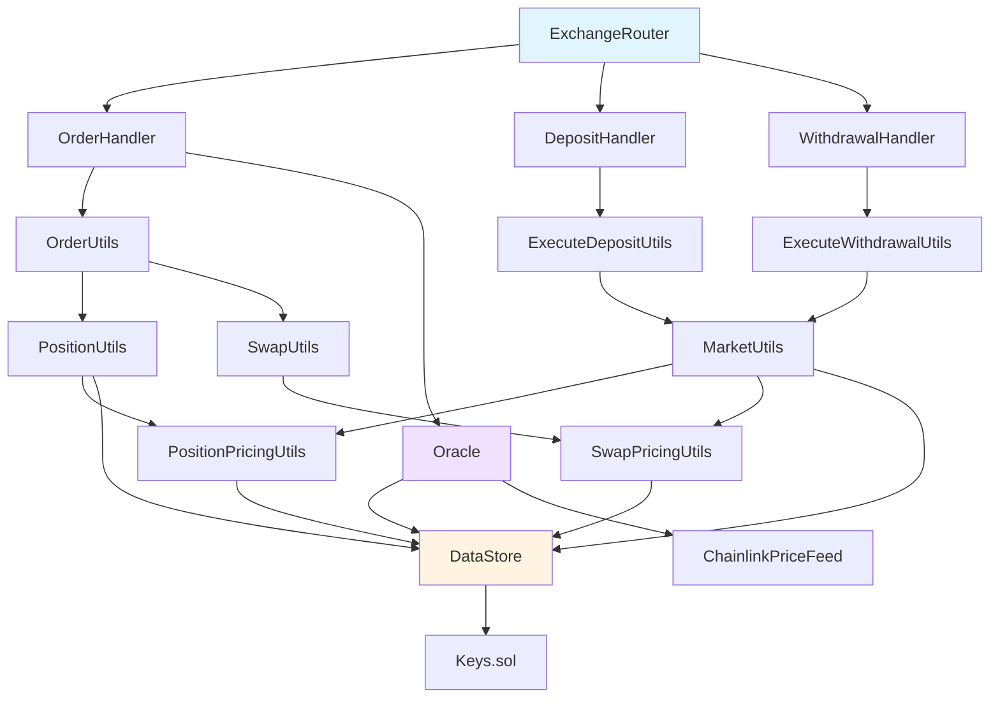

# GMX Synthetics - Component Reference

Complete reference for all 42 contract modules in the GMX Synthetics protocol.

## Table of Contents

1. [Module Overview](#module-overview)
2. [Core Trading Modules](#core-trading-modules)
3. [Liquidity Modules](#liquidity-modules)
4. [GLV Modules](#glv-modules)
5. [Exchange & Handler Modules](#exchange--handler-modules)
6. [Pricing & Fee Modules](#pricing--fee-modules)
7. [Oracle & External Data](#oracle--external-data)
8. [Data & Storage Modules](#data--storage-modules)
9. [Access Control & Security](#access-control--security)
10. [Supporting Modules](#supporting-modules)

---

## Module Overview

| # | Module | Primary Purpose | Key Contracts | Complexity |
|---|--------|-----------------|---------------|------------|
| 1 | market/ | Market management | Market.sol, MarketUtils.sol, MarketFactory.sol | High |
| 2 | order/ | Order system | Order.sol, OrderHandler.sol, OrderUtils.sol | High |
| 3 | position/ | Position management | Position.sol, PositionUtils.sol | High |
| 4 | deposit/ | Liquidity deposits | Deposit.sol, ExecuteDepositUtils.sol | Medium |
| 5 | withdrawal/ | Liquidity withdrawals | Withdrawal.sol, ExecuteWithdrawalUtils.sol | Medium |
| 6 | glv/ | GLV vaults | Glv.sol, GlvUtils.sol, GlvFactory.sol | Medium |
| 7 | glvDeposit/ | GLV deposits | GlvDeposit.sol, ExecuteGlvDepositUtils.sol | Medium |
| 8 | glvWithdrawal/ | GLV withdrawals | GlvWithdrawal.sol, ExecuteGlvWithdrawalUtils.sol | Medium |
| 9 | glvShift/ | GLV rebalancing | GlvShift.sol, GlvShiftUtils.sol | Medium |
| 10 | exchange/ | Main handlers | ExchangeRouter.sol, OrderHandler.sol | High |
| 11 | pricing/ | Pricing calculations | PositionPricingUtils.sol, SwapPricingUtils.sol | High |
| 12 | fee/ | Fee management | FeeUtils.sol, FeeHandler.sol | Medium |
| 13 | oracle/ | Price feeds | Oracle.sol, OracleStore.sol | High |
| 14 | multichain/ | Cross-chain | MultichainRouter.sol, LayerZeroProvider.sol | Medium |
| 15 | liquidation/ | Liquidations | LiquidationUtils.sol, LiquidationHandler.sol | Medium |
| 16 | adl/ | Auto-deleveraging | AdlUtils.sol, AdlHandler.sol | Medium |
| 17 | swap/ | Swap logic | SwapUtils.sol | Medium |
| 18 | referral/ | Referral system | ReferralStorage.sol | Low |
| 19 | callback/ | Callback interfaces | IOrderCallbackReceiver.sol | Low |
| 20 | reader/ | Query interfaces | Reader.sol, ReaderUtils.sol | Medium |
| 21 | router/ | Routing | Router.sol, ExchangeRouter.sol | Medium |
| 22 | bank/ | Token custody | StrictBank.sol, Bank.sol | Low |
| 23 | data/ | Central storage | DataStore.sol, Keys.sol | High |
| 24 | role/ | Access control | RoleStore.sol, RoleModule.sol | Low |
| 25 | token/ | Token utilities | TokenUtils.sol | Low |
| 26 | event/ | Event emission | EventEmitter.sol, EventUtils.sol | Low |
| 27 | config/ | Configuration | Config.sol, Timelock.sol | Medium |
| 28 | gas/ | Gas estimation | GasUtils.sol | Low |
| 29 | claim/ | Claimable rewards | ClaimUtils.sol | Low |
| 30 | chain/ | Chain utilities | Chain.sol | Low |
| 31 | error/ | Custom errors | Errors.sol | Low |
| 32 | external/ | External interfaces | IChainlinkPriceFeed.sol | Low |
| 33 | gov/ | Governance | Timelock.sol, TimelockController.sol | Low |
| 34 | migration/ | Migration utilities | MigrationHandler.sol | Low |
| 35 | mock/ | Test mocks | MockOracle.sol, MockToken.sol | Low |
| 36 | nonce/ | Nonce management | NonceUtils.sol | Low |
| 37 | subaccount/ | Subaccounts | SubaccountUtils.sol | Low |
| 38 | utils/ | General utilities | Array.sol, Cast.sol, Precision.sol | Low |
| 39 | price/ | Price structures | Price.sol | Low |
| 40 | market/ (extra) | Market tokens | MarketToken.sol | Low |
| 41 | shift/ | Market shifts | ShiftUtils.sol | Low |
| 42 | distribution/ | Value distribution | DistributionUtils.sol | Low |

---

## Core Trading Modules

### 1. market/ - Market Management

**Purpose**: Core market functionality, market creation, pool management

**Key Contracts**:
- `Market.sol:34` - Market data structure
- `MarketUtils.sol` - Core market logic (140KB, largest file)
- `MarketFactory.sol` - Market creation
- `MarketToken.sol` - ERC20 GM tokens
- `MarketStoreUtils.sol` - Market storage operations
- `PositionImpactPoolUtils.sol` - Price impact pool management

**Key Data Structures**:
```solidity
// contracts/market/Market.sol:34
struct Props {
    Addresses addresses;
    Numbers numbers;
    Flags flags;
}

struct Addresses {
    address marketToken;
    address indexToken;
    address longToken;
    address shortToken;
}
```

**Important Functions**:
- `MarketUtils.getPoolValue()` - Calculate total pool value
- `MarketUtils.getMarketTokenPrice()` - GM token pricing
- `MarketUtils.getPoolAmount()` - Get pool token balance
- `MarketUtils.applyDeltaToPoolAmount()` - Update pool balance
- `MarketFactory.createMarket()` - Create new market

**Storage Keys**:
- `Keys.MARKET` - Market address → Market props
- `Keys.MARKET_LIST` - EnumerableSet of all markets
- `Keys.POOL_AMOUNT` - Pool token amounts
- `Keys.POSITION_IMPACT_POOL_AMOUNT` - Impact pool balance

**Dependencies**: pricing/, oracle/, data/, token/

---

### 2. order/ - Order System

**Purpose**: Order management, validation, and execution routing

**Key Contracts**:
- `Order.sol:95` - Order data structure and types
- `OrderHandler.sol` - Main order execution handler
- `BaseOrderUtils.sol` - Common order operations
- `IncreaseOrderUtils.sol` - Position increase logic
- `DecreaseOrderUtils.sol` - Position decrease logic
- `SwapOrderUtils.sol` - Swap execution
- `OrderStoreUtils.sol` - Order storage
- `OrderUtils.sol` - Order type routing
- `OrderEventUtils.sol` - Order events
- `AutoCancelUtils.sol` - Auto-cancellation

**Key Data Structures**:
```solidity
// contracts/order/Order.sol:95
enum OrderType {
    MarketSwap,
    LimitSwap,
    MarketIncrease,
    LimitIncrease,
    MarketDecrease,
    LimitDecrease,
    StopLossDecrease,
    Liquidation
}

struct Props {
    Addresses addresses;
    Numbers numbers;
    Flags flags;
}
```

**Important Functions**:
- `OrderHandler.executeOrder()` - Execute any order type
- `BaseOrderUtils.createOrder()` - Create new order
- `BaseOrderUtils.cancelOrder()` - Cancel order
- `IncreaseOrderUtils.processOrder()` - Process position increase
- `DecreaseOrderUtils.processOrder()` - Process position decrease
- `SwapOrderUtils.processOrder()` - Process swap

**Storage Keys**:
- `Keys.ORDER` - Order key → Order props
- `Keys.ORDER_LIST` - Account orders list
- `Keys.ACCOUNT_ORDER_COUNT` - Order count per account

**Dependencies**: position/, pricing/, oracle/, swap/

---

### 3. position/ - Position Management

**Purpose**: Position tracking, PnL calculation, position updates

**Key Contracts**:
- `Position.sol:29` - Position data structure
- `PositionUtils.sol` - Core position logic
- `IncreasePositionUtils.sol` - Open/increase positions
- `DecreasePositionUtils.sol` - Close/decrease positions
- `DecreasePositionCollateralUtils.sol` - Collateral management
- `DecreasePositionSwapUtils.sol` - Output token swaps
- `PositionStoreUtils.sol` - Position storage
- `PositionEventUtils.sol` - Position events

**Key Data Structures**:
```solidity
// contracts/position/Position.sol:29
struct Props {
    Addresses addresses;
    Numbers numbers;
    Flags flags;
}

struct Numbers {
    uint256 sizeInUsd;
    uint256 sizeInTokens;
    uint256 collateralAmount;
    uint256 borrowingFactor;
    uint256 fundingFeeAmountPerSize;
    uint256 longTokenClaimableFundingAmountPerSize;
    uint256 shortTokenClaimableFundingAmountPerSize;
    uint256 increasedAtBlock;
    uint256 decreasedAtBlock;
}
```

**Important Functions**:
- `PositionUtils.getPositionKey()` - Calculate position key
- `PositionUtils.getPositionPnlUsd()` - Calculate PnL
- `IncreasePositionUtils.increasePosition()` - Increase position
- `DecreasePositionUtils.decreasePosition()` - Decrease position
- `PositionUtils.isPositionLiquidatable()` - Check liquidation

**Storage Keys**:
- `Keys.POSITION` - Position key → Position props
- `Keys.POSITION_LIST` - Account positions list
- `Keys.ACCOUNT_POSITION_COUNT` - Position count

**Dependencies**: market/, pricing/, oracle/, swap/

---

## Liquidity Modules

### 4. deposit/ - Liquidity Deposits

**Purpose**: Handle liquidity provision (minting GM tokens)

**Key Contracts**:
- `Deposit.sol:24` - Deposit data structure
- `DepositHandler.sol` - Deposit execution handler
- `ExecuteDepositUtils.sol` - Deposit execution logic
- `DepositVault.sol` - Token custody for deposits
- `DepositStoreUtils.sol` - Deposit storage
- `DepositUtils.sol` - Deposit utilities
- `DepositEventUtils.sol` - Deposit events

**Key Data Structures**:
```solidity
// contracts/deposit/Deposit.sol:24
struct Props {
    Addresses addresses;
    Numbers numbers;
    Flags flags;
}

struct Numbers {
    uint256 initialLongTokenAmount;
    uint256 initialShortTokenAmount;
    uint256 minMarketTokens;
    uint256 updatedAtBlock;
    uint256 executionFee;
    uint256 callbackGasLimit;
}
```

**Important Functions**:
- `DepositHandler.executeDeposit()` - Execute deposit
- `ExecuteDepositUtils.executeDeposit()` - Main execution logic
- `ExecuteDepositUtils._executeDeposit()` - Core deposit logic
- `DepositUtils.createDeposit()` - Create deposit request

**Storage Keys**:
- `Keys.DEPOSIT` - Deposit key → Deposit props
- `Keys.DEPOSIT_LIST` - Account deposits list
- `Keys.ACCOUNT_DEPOSIT_COUNT` - Deposit count

**Dependencies**: market/, pricing/, swap/

---

### 5. withdrawal/ - Liquidity Withdrawals

**Purpose**: Handle liquidity removal (burning GM tokens)

**Key Contracts**:
- `Withdrawal.sol:24` - Withdrawal data structure
- `WithdrawalHandler.sol` - Withdrawal execution handler
- `ExecuteWithdrawalUtils.sol` - Withdrawal execution logic
- `WithdrawalVault.sol` - Token custody for withdrawals
- `WithdrawalStoreUtils.sol` - Withdrawal storage
- `WithdrawalUtils.sol` - Withdrawal utilities
- `WithdrawalEventUtils.sol` - Withdrawal events

**Key Data Structures**:
```solidity
// contracts/withdrawal/Withdrawal.sol:24
struct Props {
    Addresses addresses;
    Numbers numbers;
    Flags flags;
}

struct Numbers {
    uint256 marketTokenAmount;
    uint256 minLongTokenAmount;
    uint256 minShortTokenAmount;
    uint256 updatedAtBlock;
    uint256 executionFee;
    uint256 callbackGasLimit;
}
```

**Important Functions**:
- `WithdrawalHandler.executeWithdrawal()` - Execute withdrawal
- `ExecuteWithdrawalUtils.executeWithdrawal()` - Main execution logic
- `ExecuteWithdrawalUtils._executeWithdrawal()` - Core withdrawal logic
- `WithdrawalUtils.createWithdrawal()` - Create withdrawal request

**Storage Keys**:
- `Keys.WITHDRAWAL` - Withdrawal key → Withdrawal props
- `Keys.WITHDRAWAL_LIST` - Account withdrawals list
- `Keys.ACCOUNT_WITHDRAWAL_COUNT` - Withdrawal count

**Dependencies**: market/, pricing/, swap/

---

## GLV Modules

### 6. glv/ - GLV Vaults

**Purpose**: Multi-market liquidity vault management

**Key Contracts**:
- `Glv.sol:16` - GLV data structure
- `GlvFactory.sol` - GLV creation
- `GlvToken.sol` - ERC20 GLV tokens
- `GlvUtils.sol` - Core GLV logic
- `GlvStoreUtils.sol` - GLV storage

**Key Data Structures**:
```solidity
// contracts/glv/Glv.sol:16
struct Props {
    address glvToken;
    address longToken;
    address shortToken;
}
```

**Important Functions**:
- `GlvFactory.createGlv()` - Create new GLV
- `GlvUtils.getGlvValue()` - Calculate GLV total value
- `GlvUtils.getGlvMarkets()` - Get underlying markets
- `GlvUtils.applyDeltaToGlvMarketBalance()` - Update market balance

**Storage Keys**:
- `Keys.GLV` - GLV address → GLV props
- `Keys.GLV_LIST` - EnumerableSet of all GLVs
- `Keys.GLV_MARKETS` - GLV markets list
- `Keys.GLV_MARKET_BALANCE` - GM token balance per market

**Dependencies**: market/, data/

---

### 7-9. glvDeposit/, glvWithdrawal/, glvShift/ - GLV Operations

**Purpose**: GLV deposit, withdrawal, and rebalancing operations

**Key Contracts** (similar structure for each):
- `GlvDeposit.sol`, `GlvWithdrawal.sol`, `GlvShift.sol` - Data structures
- `ExecuteGlvDepositUtils.sol`, `ExecuteGlvWithdrawalUtils.sol`, `GlvShiftUtils.sol` - Execution logic
- `GlvDepositHandler.sol`, `GlvWithdrawalHandler.sol`, `ShiftHandler.sol` - Handlers

**Important Functions**:
- GLV Deposit: `executeGlvDeposit()` - Mint GLV tokens
- GLV Withdrawal: `executeGlvWithdrawal()` - Burn GLV tokens
- GLV Shift: `executeGlvShift()` - Rebalance between markets

**Dependencies**: glv/, market/, deposit/, withdrawal/

---

## Exchange & Handler Modules

### 10. exchange/ - Main Handlers

**Purpose**: User-facing routers and execution handlers

**Key Contracts**:
- `ExchangeRouter.sol:192` - Main user entry point
- `OrderHandler.sol:84` - Order execution
- `DepositHandler.sol:95` - Deposit execution
- `WithdrawalHandler.sol:94` - Withdrawal execution
- `LiquidationHandler.sol:46` - Liquidation execution
- `AdlHandler.sol:51` - ADL execution
- `ShiftHandler.sol:52` - Shift execution
- `GlvDepositHandler.sol` - GLV deposit execution
- `GlvWithdrawalHandler.sol` - GLV withdrawal execution

**Important Functions**:
- `ExchangeRouter.createOrder()` - Create order
- `ExchangeRouter.createDeposit()` - Create deposit
- `ExchangeRouter.createWithdrawal()` - Create withdrawal
- `OrderHandler.executeOrder()` - Execute order
- `DepositHandler.executeDeposit()` - Execute deposit

**Dependencies**: All core modules

---

## Pricing & Fee Modules

### 11. pricing/ - Pricing Calculations

**Purpose**: Price impact, funding fees, borrowing fees

**Key Contracts**:
- `PositionPricingUtils.sol:89` - Position price impact
- `SwapPricingUtils.sol:67` - Swap price impact
- `PricingUtils.sol` - General pricing utilities

**Important Functions**:
- `PositionPricingUtils.getPriceImpactUsd()` - Calculate position price impact
- `SwapPricingUtils.getPriceImpactUsd()` - Calculate swap price impact
- `PositionPricingUtils.getPositionFees()` - Calculate all position fees
- `PositionPricingUtils.getFundingFees()` - Calculate funding fees
- `PositionPricingUtils.getBorrowingFees()` - Calculate borrowing fees

**Dependencies**: market/, oracle/

---

### 12. fee/ - Fee Management

**Purpose**: Fee collection and distribution

**Key Contracts**:
- `FeeUtils.sol` - Fee calculations
- `FeeHandler.sol` - Fee collection
- `FeeDistributor.sol` - Fee distribution

**Important Functions**:
- `FeeUtils.applyFee()` - Apply fee to amount
- `FeeHandler.claimFees()` - Claim accumulated fees

**Dependencies**: pricing/, market/

---

## Oracle & External Data

### 13. oracle/ - Price Feeds

**Purpose**: Oracle price validation and management

**Key Contracts**:
- `Oracle.sol:242` - Main oracle contract
- `OracleStore.sol` - Oracle configuration
- `OracleUtils.sol:78` - Oracle utilities
- `ChainlinkPriceFeedProvider.sol:35` - Chainlink integration
- `ChainlinkDataStreamProvider.sol` - Chainlink streams
- `EdgeDataStreamProvider.sol` - Edge oracle
- `GmOracleProvider.sol` - GM token pricing

**Key Data Structures**:
```solidity
// contracts/oracle/Oracle.sol:80
struct SetPricesParams {
    uint256 signerInfo;
    address[] tokens;
    uint256[] compactedMinOracleBlockNumbers;
    uint256[] compactedMaxOracleBlockNumbers;
    uint256[] compactedOracleTimestamps;
    uint256[] compactedDecimals;
    uint256[] compactedMinPrices;
    uint256[] compactedMinPricesIndexes;
    uint256[] compactedMaxPrices;
    uint256[] compactedMaxPricesIndexes;
    bytes[] signatures;
    address[] priceFeedTokens;
    address[] realtimeFeedTokens;
    bytes[] realtimeFeedData;
}
```

**Important Functions**:
- `Oracle.setPrices()` - Set oracle prices
- `Oracle.getPrimaryPrice()` - Get validated price
- `OracleUtils.validateSigner()` - Validate signature

**Dependencies**: data/, external/

---

### 14. multichain/ - Cross-Chain Operations

**Purpose**: LayerZero integration for cross-chain operations

**Key Contracts**:
- `MultichainRouter.sol` - Cross-chain router
- `MultichainOrderRouter.sol` - Cross-chain orders
- `MultichainGmRouter.sol` - Cross-chain GM operations
- `MultichainGlvRouter.sol` - Cross-chain GLV operations
- `MultichainClaimsRouter.sol` - Cross-chain claims
- `LayerZeroProvider.sol` - LayerZero integration

**Important Functions**:
- `MultichainOrderRouter.createMultichainOrder()` - Create cross-chain order
- `LayerZeroProvider.lzReceive()` - Receive cross-chain message

**Dependencies**: exchange/, oracle/

---

## Data & Storage Modules

### 23. data/ - Central Storage

**Purpose**: Key-value storage for all protocol data

**Key Contracts**:
- `DataStore.sol` - Central storage contract
- `Keys.sol` - Configuration keys (108KB)
- `Keys2.sol` - Additional keys

**Important Functions**:
- `DataStore.setUint()`, `getUint()` - Uint storage
- `DataStore.setInt()`, `getInt()` - Int storage
- `DataStore.setAddress()`, `getAddress()` - Address storage
- `DataStore.setBool()`, `getBool()` - Bool storage
- `DataStore.setBytes32()`, `getBytes32()` - Bytes32 storage

**Storage Pattern**:
```solidity
// Key generation
bytes32 key = keccak256(abi.encode("SOME_KEY", param1, param2));

// Set value
dataStore.setUint(key, value);

// Get value
uint256 value = dataStore.getUint(key);
```

---

### 24. role/ - Access Control

**Purpose**: Role-based access control

**Key Contracts**:
- `RoleStore.sol` - Role storage
- `RoleModule.sol` - Role validation
- `Role.sol` - Role definitions

**Key Roles**:
```solidity
bytes32 public constant CONTROLLER = keccak256(abi.encode("CONTROLLER"));
bytes32 public constant ORDER_KEEPER = keccak256(abi.encode("ORDER_KEEPER"));
bytes32 public constant LIQUIDATION_KEEPER = keccak256(abi.encode("LIQUIDATION_KEEPER"));
bytes32 public constant CONFIG_KEEPER = keccak256(abi.encode("CONFIG_KEEPER"));
bytes32 public constant ADL_KEEPER = keccak256(abi.encode("ADL_KEEPER"));
```

**Important Functions**:
- `RoleStore.grantRole()` - Grant role to address
- `RoleStore.revokeRole()` - Revoke role
- `RoleModule.validateRole()` - Check role permission

---

## Supporting Modules

### 15. liquidation/ - Liquidations
**Purpose**: Position liquidation logic
**Key**: `LiquidationUtils.sol:83` - Liquidation validation

### 16. adl/ - Auto-Deleveraging
**Purpose**: Auto-deleverage profitable positions
**Key**: `AdlUtils.sol:223` - ADL state management

### 17. swap/ - Swap Logic
**Purpose**: Token swap execution
**Key**: `SwapUtils.sol:79` - Swap execution

### 18. referral/ - Referral System
**Purpose**: Referral tracking and rewards
**Key**: `ReferralStorage.sol` - Referral data

### 19. callback/ - Callback Interfaces
**Purpose**: Callback hooks for integrations
**Key**: `IOrderCallbackReceiver.sol` - Order callbacks

### 20. reader/ - Query Interfaces
**Purpose**: Read-only query functions
**Key**: `Reader.sol` - Main query interface

### 21. router/ - Routing
**Purpose**: Generic routing logic
**Key**: `Router.sol` - Base router

### 22. bank/ - Token Custody
**Purpose**: Secure token holding
**Key**: `StrictBank.sol` - Token vault with reentrancy guard

### 26. event/ - Event Emission
**Purpose**: Standardized event emission
**Key**: `EventEmitter.sol`, `EventUtils.sol`

### 27. config/ - Configuration
**Purpose**: Timelock-based configuration
**Key**: `Config.sol`, `Timelock.sol`

### 28-42. Utility Modules
Supporting utilities for gas, claims, errors, testing, etc.

---

## Module Dependency Graph



---

## Related Documentation

- **[ARCHITECTURE.md](./ARCHITECTURE.md)** - System architecture
- **[TRADING_FLOWS.md](./TRADING_FLOWS.md)** - Trading flows
- **[LIQUIDITY_FLOWS.md](./LIQUIDITY_FLOWS.md)** - Liquidity flows
- **[GLV_FLOWS.md](./GLV_FLOWS.md)** - GLV flows
- **[PRICING_FLOWS.md](./PRICING_FLOWS.md)** - Pricing mechanisms
- **[ORACLE_FLOWS.md](./ORACLE_FLOWS.md)** - Oracle system
- **[INTEGRATION.md](./INTEGRATION.md)** - Integration guide

---

*Last Updated: 2025-12-01*
*For detailed flow diagrams and usage examples, see the flow-specific documentation files.*
