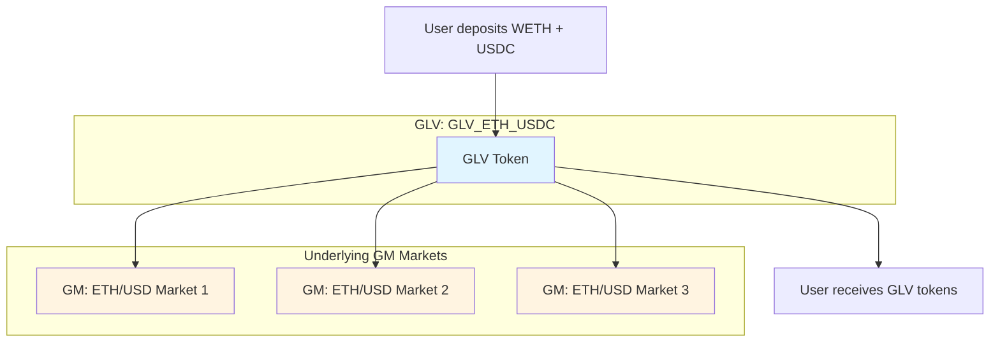
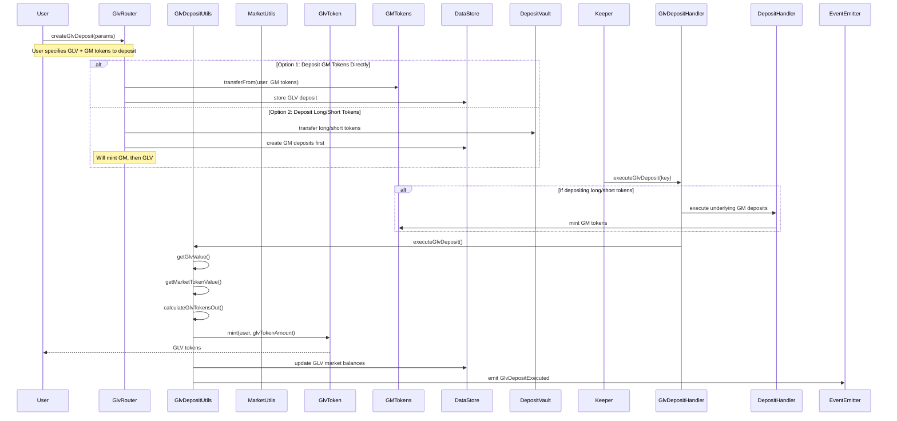
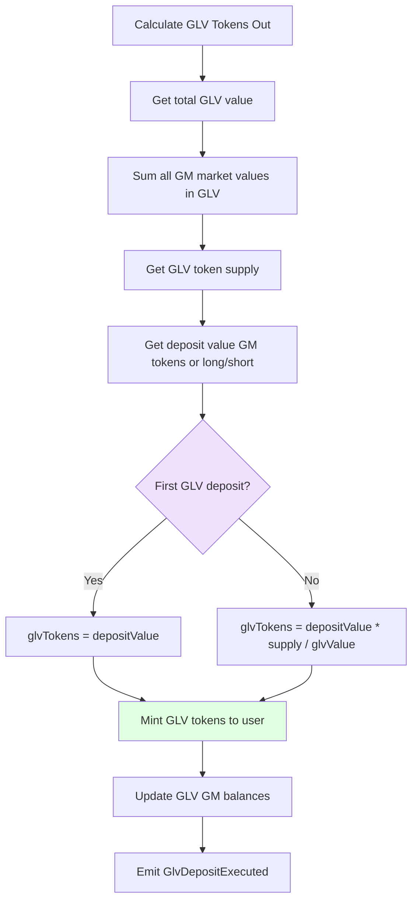
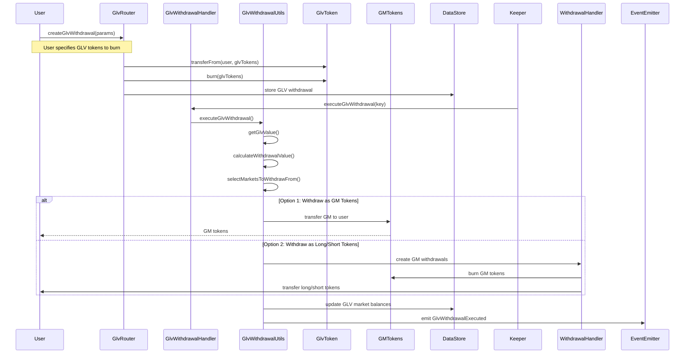
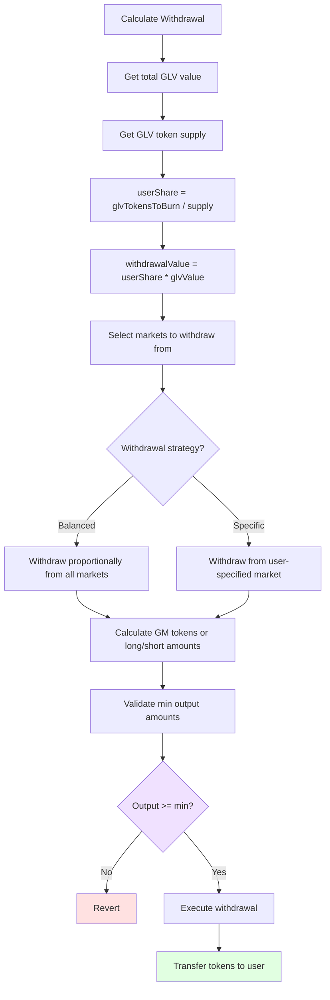
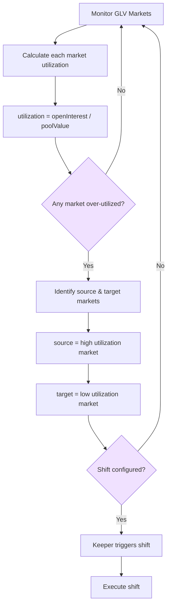
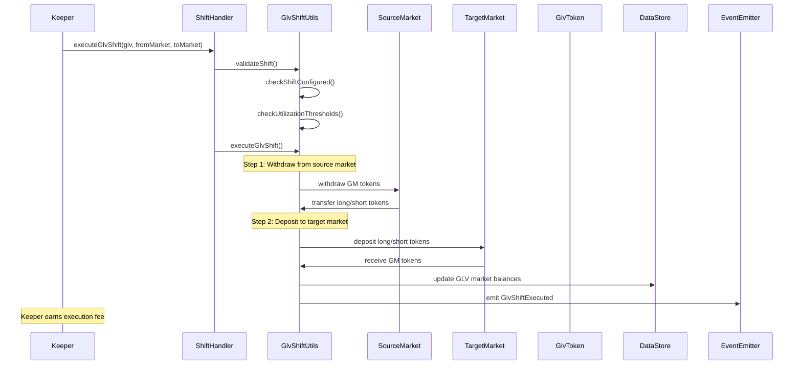
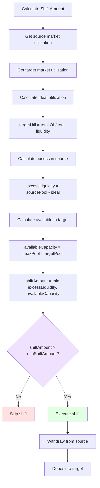
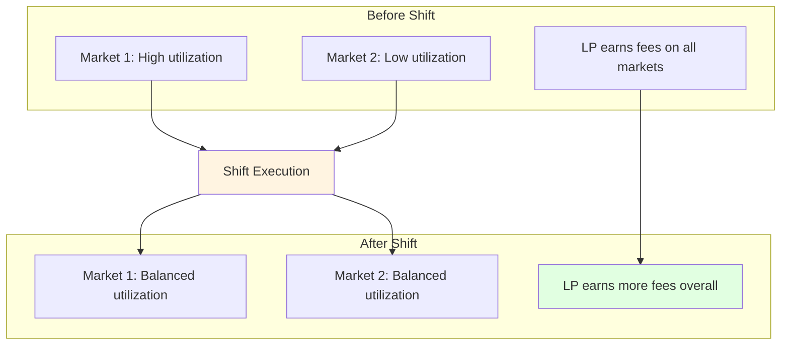
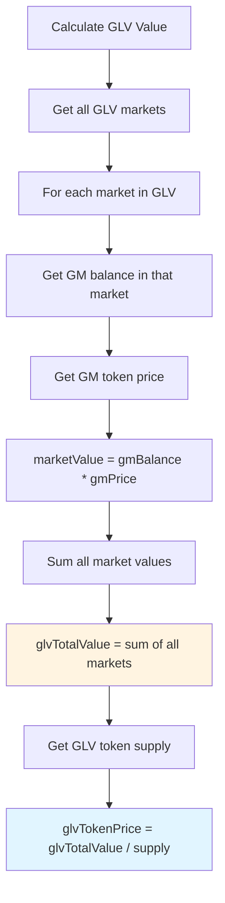

# GMX Synthetics - GLV Flows

## Table of Contents
1. [GLV Overview](#glv-overview)
2. [GLV Deposit Flow](#glv-deposit-flow)
3. [GLV Withdrawal Flow](#glv-withdrawal-flow)
4. [GLV Shift (Rebalancing)](#glv-shift-rebalancing)
5. [GLV Token Pricing](#glv-token-pricing)

---

## GLV Overview

### What is a GLV?

**GLV (GMX Liquidity Vault)** is a liquidity aggregation layer that wraps multiple GM markets into a single token.



**Benefits:**
- **Unified Liquidity**: Single token represents multiple markets
- **Auto-Rebalancing**: Shifts liquidity based on utilization
- **Reduced Fragmentation**: LPs don't need to choose specific markets
- **Diversified Exposure**: Risk spread across multiple markets
- **Better Depth**: More liquidity available for traders

**Code References:**
- `contracts/glv/Glv.sol:16` - GLV data structure
- `contracts/glv/GlvFactory.sol` - GLV creation
- `contracts/glv/GlvToken.sol` - ERC20 GLV token

### GLV Data Structure

```solidity
// contracts/glv/Glv.sol:16

struct Props {
    address glvToken;      // GLV ERC20 token address
    address longToken;     // Common long token (e.g., WETH)
    address shortToken;    // Common short token (e.g., USDC)
}

// GLV contains list of GM markets
// All markets must use same long/short tokens
address[] markets = getGlvMarkets(dataStore, glvAddress);
```

**Code Reference:**
- `contracts/glv/Glv.sol:16`

---

## GLV Deposit Flow

### GLV Deposit Process



**Code References:**
- `contracts/router/GlvRouter.sol` - User-facing GLV operations
- `contracts/exchange/GlvDepositHandler.sol` - GLV deposit execution
- `contracts/glvDeposit/ExecuteGlvDepositUtils.sol` - GLV deposit logic

### GLV Deposit Options

**Option 1: Deposit GM Tokens**
```solidity
// Already have GM tokens, want to wrap into GLV
createGlvDeposit({
    glv: glvEthUsdc,
    market: ethUsdMarket1,
    marketTokenAmount: gmTokens, // Existing GM tokens
    // ...
});
```

**Option 2: Deposit Long/Short Tokens**
```solidity
// Deposit WETH + USDC directly into GLV
// Will first mint GM, then mint GLV
createGlvDeposit({
    glv: glvEthUsdc,
    initialLongTokenAmount: wethAmount,
    initialShortTokenAmount: usdcAmount,
    // ...
});
```

**Code References:**
- `contracts/glvDeposit/GlvDepositUtils.sol:45` - `createGlvDeposit()`

### GLV Token Amount Calculation



**Formula:**

```solidity
// contracts/glvDeposit/ExecuteGlvDepositUtils.sol

function getGlvTokensOut(
    DataStore dataStore,
    address glv,
    MarketPrices prices,
    uint256 depositValue
) internal view returns (uint256) {
    // Get total GLV value
    uint256 glvValue = GlvUtils.getGlvValue(dataStore, glv, prices);

    // Get GLV token supply
    uint256 supply = getGlvTokenSupply(glv);

    // Calculate GLV tokens to mint
    if (supply == 0) {
        return depositValue;
    } else {
        return depositValue * supply / glvValue;
    }
}
```

**Code References:**
- `contracts/glv/GlvUtils.sol:123` - `getGlvValue()`
- `contracts/glvDeposit/ExecuteGlvDepositUtils.sol` - GLV token calculation

---

## GLV Withdrawal Flow

### GLV Withdrawal Process



**Code References:**
- `contracts/router/GlvRouter.sol` - GLV withdrawal creation
- `contracts/exchange/GlvWithdrawalHandler.sol` - Withdrawal execution
- `contracts/glvWithdrawal/ExecuteGlvWithdrawalUtils.sol` - Withdrawal logic

### GLV Withdrawal Options

**Option 1: Withdraw as GM Tokens**
```solidity
// Receive GM tokens (don't unwrap)
createGlvWithdrawal({
    glv: glvEthUsdc,
    glvTokenAmount: glvTokens,
    market: ethUsdMarket1, // Which GM market to withdraw from
    shouldUnwrapGmToken: false,
    // ...
});
```

**Option 2: Withdraw as Long/Short Tokens**
```solidity
// Receive WETH + USDC (unwrap GM tokens)
createGlvWithdrawal({
    glv: glvEthUsdc,
    glvTokenAmount: glvTokens,
    shouldUnwrapGmToken: true,
    minLongTokenAmount: minWeth,
    minShortTokenAmount: minUsdc,
    // ...
});
```

**Code References:**
- `contracts/glvWithdrawal/GlvWithdrawalUtils.sol:47` - `createGlvWithdrawal()`

### GLV Withdrawal Amount Calculation



**Code References:**
- `contracts/glv/GlvUtils.sol:123` - `getGlvValue()`
- `contracts/glvWithdrawal/ExecuteGlvWithdrawalUtils.sol` - Withdrawal calculation

---

## GLV Shift (Rebalancing)

### Why Shift?

GLV automatically rebalances liquidity between underlying markets based on utilization.

**Goals:**
- Keep liquidity where it's most needed
- Maximize LP fee generation
- Balance risk across markets
- Maintain efficient capital allocation

### Shift Trigger Conditions



**Code References:**
- `contracts/glvShift/GlvShiftUtils.sol` - Shift logic
- `contracts/exchange/ShiftHandler.sol` - Shift execution

### Shift Execution Flow



**Code References:**
- `contracts/exchange/ShiftHandler.sol:52` - `executeGlvShift()`
- `contracts/glvShift/GlvShiftUtils.sol:91` - `executeGlvShift()`

### Shift Configuration

```solidity
// config/glvs.ts

export const glvs = {
    arbitrum: {
        "GLV_ETH_USDC": {
            markets: [
                "ETH/USD [ETH-USDC]",
                "ETH/USD [ETH-DAI]",
                "ETH/USD [ETH-USDT]"
            ],
            shifts: [
                { fromMarket: 0, toMarket: 1 }, // Market 0 → Market 1
                { fromMarket: 0, toMarket: 2 }, // Market 0 → Market 2
                { fromMarket: 1, toMarket: 0 }, // Market 1 → Market 0
                { fromMarket: 1, toMarket: 2 }, // Market 1 → Market 2
                { fromMarket: 2, toMarket: 0 }, // Market 2 → Market 0
                { fromMarket: 2, toMarket: 1 }, // Market 2 → Market 1
            ]
        }
    }
}
```

**Code References:**
- `config/glvs.ts` - GLV and shift configurations
- `contracts/glv/GlvUtils.sol:230` - Shift validation

### Shift Amount Calculation



**Code References:**
- `contracts/glvShift/GlvShiftUtils.sol:172` - Shift amount logic

### Shift Impact on LPs



**Benefits for LPs:**
- Better capital efficiency
- Higher fee generation
- Balanced risk exposure
- Automatic optimization

---

## GLV Token Pricing

### GLV Value Calculation



**Formula:**

```solidity
// contracts/glv/GlvUtils.sol:123

function getGlvValue(
    DataStore dataStore,
    address glv,
    MarketPrices[] prices
) internal view returns (uint256) {
    uint256 totalValue = 0;

    // Get all markets in GLV
    address[] memory markets = getGlvMarkets(dataStore, glv);

    for (uint256 i = 0; i < markets.length; i++) {
        address market = markets[i];

        // Get GLV's GM balance for this market
        uint256 gmBalance = getGlvMarketBalance(dataStore, glv, market);

        // Get GM token value
        uint256 gmValue = MarketUtils.getMarketTokenValue(
            dataStore,
            market,
            prices[i],
            gmBalance
        );

        totalValue += gmValue;
    }

    return totalValue;
}
```

**Code References:**
- `contracts/glv/GlvUtils.sol:123` - `getGlvValue()`
- `contracts/market/MarketUtils.sol` - GM token value
- `contracts/reader/ReaderUtils.sol` - GLV info queries

### GLV Market Balances

GLV tracks how much of each GM market it holds:

```solidity
// Get GLV's balance of a specific GM market
uint256 gmBalance = dataStore.getUint(
    Keys.glvMarketBalanceKey(glv, market)
);

// Updated on:
// - GLV deposits (increases)
// - GLV withdrawals (decreases)
// - Shifts (moves balance between markets)
```

**Code References:**
- `contracts/glv/GlvUtils.sol:285` - `applyDeltaToGlvMarketBalance()`
- `contracts/data/Keys.sol` - GLV balance keys

### Reading GLV Info

```solidity
// Get GLV info via Reader
struct GlvInfo {
    address glv;
    address glvToken;
    address longToken;
    address shortToken;
    address[] markets;
    uint256[] marketBalances;
    uint256 glvTokenSupply;
    uint256 glvValue;
}

GlvInfo memory glvInfo = reader.getGlvInfo(
    dataStore,
    glvAddress,
    prices
);
```

**Code References:**
- `contracts/reader/Reader.sol` - GLV query functions
- `contracts/reader/ReaderUtils.sol` - GLV data helpers

---

## GLV Fee Distribution

### Fee Flow in GLV

```mermaid
graph TD
    subgraph "GM Markets"
        M1[Market 1: Collects fees]
        M2[Market 2: Collects fees]
        M3[Market 3: Collects fees]
    end

    subgraph "GLV"
        GLV[GLV Token Holders]
    end

    M1 --> |Fees accrue to GM| M1V[GM token value increases]
    M2 --> |Fees accrue to GM| M2V[GM token value increases]
    M3 --> |Fees accrue to GM| M3V[GM token value increases]

    M1V --> GLV
    M2V --> GLV
    M3V --> GLV

    GLV --> LP[LP earns fees from all markets]

    style M1V fill:#e1ffe1
    style M2V fill:#e1ffe1
    style M3V fill:#e1ffe1
    style LP fill:#e1f5ff
```

**Key Point:**
- GLV doesn't collect separate fees
- GLV holds GM tokens
- GM tokens accrue value from underlying market fees
- GLV token value increases as GM tokens increase

---

## GLV Management

### Adding Markets to GLV

```solidity
// Add new market to GLV
GlvUtils.addMarketToGlv(
    dataStore,
    glv,
    newMarket
);

// Requirements:
// - Market must use same long/short tokens as GLV
// - Called via timelock configuration
```

**Code References:**
- `contracts/glv/GlvUtils.sol:315` - `addMarketToGlv()`

### Removing Markets from GLV

```solidity
// Remove market from GLV
GlvUtils.removeMarketFromGlv(
    dataStore,
    glv,
    market
);

// Requirements:
// - GLV must have zero balance in that market
// - Called via timelock configuration
```

**Code References:**
- `contracts/glv/GlvUtils.sol:345` - `removeMarketFromGlv()`

### GLV Configuration Keys

```solidity
// contracts/data/Keys.sol

// GLV token address
glvTokenKey(glv)

// Markets in GLV
glvMarketsKey(glv)

// GLV balance of specific GM market
glvMarketBalanceKey(glv, market)

// Shift configuration
isGlvShiftEnabledKey(glv, fromMarket, toMarket)
```

**Code References:**
- `contracts/data/Keys.sol` - GLV configuration keys
- `contracts/glv/GlvUtils.sol` - GLV configuration functions

---

## Related Documentation

- **[ARCHITECTURE.md](./ARCHITECTURE.md)** - System architecture
- **[TRADING_FLOWS.md](./TRADING_FLOWS.md)** - Trading operations
- **[LIQUIDITY_FLOWS.md](./LIQUIDITY_FLOWS.md)** - GM deposit/withdrawal
- **[PRICING_FLOWS.md](./PRICING_FLOWS.md)** - Pricing mechanisms

---

*Last Updated: 2025-12-01*
