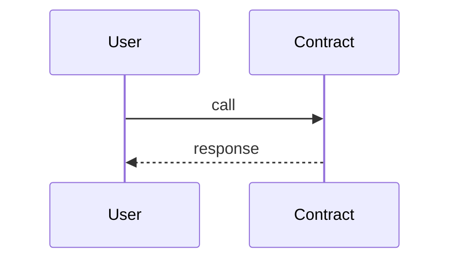
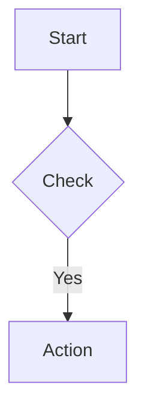
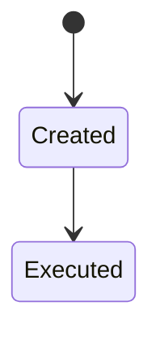
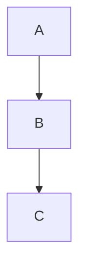

# GMX Synthetics - Technical Documentation Index

Welcome to the GMX Synthetics technical documentation. This comprehensive documentation provides detailed insights into the protocol's architecture, flows, and implementation.

## Documentation Structure

### Core Documentation

#### 📚 [ARCHITECTURE.md](./ARCHITECTURE.md)
**Complete system architecture documentation**
- Project overview and purpose
- High-level component architecture with diagrams
- Directory structure (42 contract modules, 309 contracts)
- Core domain concepts (Markets, Positions, Orders, Deposits, Withdrawals, GLVs)
- Configuration and deployment processes
- Security considerations and access control
- Development guidelines and testing standards

**→ Start here for a high-level understanding of the system**

---

### Process Flow Documentation (with Mermaid Diagrams)

#### 🔄 [TRADING_FLOWS.md](./TRADING_FLOWS.md)
**Detailed trading operation flows**
- **Order Lifecycle**: Creation → Execution → Settlement with sequence diagrams
- **Position Management**: Opening and closing positions with all fee calculations
- **Swap Operations**: Simple and multi-hop swaps with price impact
- **Liquidations**: Liquidation conditions, validation, and execution flow
- **Auto-Deleveraging (ADL)**: Trigger conditions, position selection, and execution
- **Order Types Reference**: Market vs. limit orders comparison

#### 💧 [LIQUIDITY_FLOWS.md](./LIQUIDITY_FLOWS.md)
**Liquidity provision and management**
- **Deposit Flow**: Complete deposit process with price impact calculations
- **Withdrawal Flow**: Withdrawal process and amount calculations with options
- **Market Token Pricing**: GM token value calculation formulas
- **Liquidity Management**: Pool balances, reserves, utilization tracking
- **Fee Structure**: Deposit/withdrawal fee breakdown

#### 🏦 [GLV_FLOWS.md](./GLV_FLOWS.md)
**GLV (GMX Liquidity Vault) operations**
- **GLV Overview**: Multi-market liquidity aggregation concept
- **GLV Deposit Flow**: Depositing into GLV vaults (GM tokens or long/short tokens)
- **GLV Withdrawal Flow**: Withdrawing from GLV vaults with unwrap options
- **GLV Shift (Rebalancing)**: Auto-rebalancing mechanism between markets
- **GLV Token Pricing**: Value calculation across multiple underlying markets
- **GLV Management**: Adding/removing markets, configuration

#### 💰 [PRICING_FLOWS.md](./PRICING_FLOWS.md)
**Comprehensive pricing mechanisms**
- **Price Impact**: Calculation formula, positive/negative impact, virtual inventory
- **Funding Fees**: Long/short balancing mechanism with examples
- **Borrowing Fees**: LP compensation for liquidity usage based on utilization
- **Position Fees**: Fee structure and breakdown with components
- **Fee Distribution**: How fees flow to LPs, protocol, UI providers, referrals

#### 🔮 [ORACLE_FLOWS.md](./ORACLE_FLOWS.md)
**Oracle system and cross-chain operations**
- **Oracle System**: Two-step execution model for MEV protection
- **Price Validation**: Multi-signer validation and reasonableness checks
- **Oracle Providers**: Chainlink (price feeds, data streams), Edge, GM oracle integrations
- **Multichain Operations**: LayerZero cross-chain flows for orders, deposits, withdrawals
- **Oracle Security**: Multi-signer validation, price compaction, sequencer checks

---

### Reference Documentation

#### 📦 [COMPONENTS.md](./COMPONENTS.md)
**Complete contract component reference**
- **Module Overview**: All 42 contract modules with complexity ratings
- **Core Trading Modules**: market/, order/, position/ detailed breakdown
- **Liquidity Modules**: deposit/, withdrawal/ implementation details
- **GLV Modules**: glv/, glvDeposit/, glvWithdrawal/, glvShift/ reference
- **Supporting Modules**: pricing/, fee/, oracle/, data/, role/, and 33 more
- **Data Structures**: Key structs, enums, and storage patterns
- **Function Reference**: Important functions with signatures
- **Dependencies**: Inter-module dependency mapping

#### 🔌 [INTEGRATION.md](./INTEGRATION.MD)
**Developer integration guide**
- **Quick Start**: Contract addresses and basic setup
- **ExchangeRouter Interface**: Creating orders, deposits, withdrawals with code examples
- **Reader Contract Usage**: Querying markets, positions, orders, account data
- **Event Monitoring**: Key events, listeners, filtering examples
- **Callback System**: Implementing custom callbacks with full examples
- **Gas Estimation**: Execution fee calculation and optimization
- **Transaction Examples**: Complete flows for common operations
- **Error Handling**: Common errors and recovery strategies
- **Testing & Development**: Local setup, testnet deployment, mock data

---

## Quick Navigation

### 🆕 For New Developers

**Learning Path:**
1. **[ARCHITECTURE.md](./ARCHITECTURE.md)** - Understand the system architecture
2. **[TRADING_FLOWS.md](./TRADING_FLOWS.md)** - Learn how trading works
3. **[PRICING_FLOWS.md](./PRICING_FLOWS.md)** - Understand fee mechanisms
4. **Explore code** - Use file:line references throughout documentation

**Key Concepts to Understand:**
- Two-step execution model (user creates request → keeper executes)
- Price impact mechanism (balance pool imbalances)
- Isolated market design (each market has separate risk)
- Role-based access control

### 🔗 For Integration Teams

**Essential Reading:**
1. **[INTEGRATION.md](./INTEGRATION.md)** - Complete integration guide with examples ⭐
2. **[ARCHITECTURE.md](./ARCHITECTURE.md)** - System overview and contracts
3. **[COMPONENTS.md](./COMPONENTS.md)** - Contract reference and function signatures
4. **[LIQUIDITY_FLOWS.md](./LIQUIDITY_FLOWS.md)** - LP operations and GM tokens
5. **[ORACLE_FLOWS.md](./ORACLE_FLOWS.md)** - Price feeds and cross-chain

**Integration Points:**
- `ExchangeRouter.sol` - Main user entry point
- `Reader.sol` - Query interface for UI
- Event monitoring for state changes
- Callback system for custom logic

### 🔒 For Security Auditors

**Critical Areas:**
1. **[ARCHITECTURE.md#security-considerations](./ARCHITECTURE.md#security-considerations)** - Security architecture
2. **[TRADING_FLOWS.md](./TRADING_FLOWS.md)** - Order execution and liquidations
3. **[PRICING_FLOWS.md](./PRICING_FLOWS.md)** - Price impact and fee calculations
4. **[ORACLE_FLOWS.md#oracle-security](./ORACLE_FLOWS.md#oracle-security)** - Price validation

**Focus Areas:**
- Oracle price validation (multi-signer, reasonableness)
- Access control (role-based permissions)
- Reentrancy protection (global guard)
- Price impact gaming prevention (virtual inventory)
- Liquidation conditions

### 📊 For Liquidity Providers

**Relevant Sections:**
1. **[LIQUIDITY_FLOWS.md](./LIQUIDITY_FLOWS.md)** - How deposits/withdrawals work
2. **[GLV_FLOWS.md](./GLV_FLOWS.md)** - Multi-market vault options
3. **[PRICING_FLOWS.md#fee-distribution](./PRICING_FLOWS.md#fee-distribution)** - How LPs earn fees

**Key Information:**
- GM tokens represent LP shares in a market
- GLV tokens represent shares across multiple markets
- Fees: borrowing, funding, position fees, swap fees
- Price impact on deposits/withdrawals

---

## Project Statistics

- **Contracts**: ~309 Solidity files across 42 functional modules
- **Deployment Scripts**: ~160 Hardhat-deploy scripts
- **Networks**: Arbitrum (primary), Avalanche, Botanix
- **Testnets**: Arbitrum Sepolia, Avalanche Fuji
- **Test Coverage**: Comprehensive across all features
- **Largest Contract**: MarketUtils.sol (140KB)

---

## Contract Directory Structure

```
/contracts/
├── market/            # Market management, MarketToken (GM)
├── order/             # Order system (market, limit, stop, liquidation)
├── position/          # Position management (long/short positions)
├── deposit/           # Liquidity deposit operations
├── withdrawal/        # Liquidity withdrawal operations
├── glv/               # GLV vault system (multi-market)
├── glvDeposit/        # GLV deposit operations
├── glvWithdrawal/     # GLV withdrawal operations
├── glvShift/          # GLV rebalancing operations
├── exchange/          # Main handlers (OrderHandler, DepositHandler, etc.)
├── pricing/           # Pricing calculations (price impact, fees)
├── fee/               # Fee management and distribution
├── oracle/            # Oracle system (price feeds, validation)
├── multichain/        # LayerZero cross-chain integration
├── liquidation/       # Liquidation logic and validation
├── adl/               # Auto-deleveraging system
├── swap/              # Swap execution logic
├── referral/          # Referral system
├── callback/          # Callback interfaces for integrations
├── reader/            # Read-only query interfaces
├── router/            # Routing contracts
├── bank/              # Vault contracts (token custody)
├── data/              # DataStore and Keys (configuration)
├── role/              # Access control (RoleStore)
├── token/             # Token utilities
├── event/             # Event emission system
├── config/            # Configuration management (Timelock)
├── gas/               # Gas estimation utilities
├── claim/             # Claimable rewards
└── [19 more modules]
```

---

## Key Contract Reference

### 🎯 Entry Points
| Contract | Purpose | Documentation |
|----------|---------|---------------|
| `ExchangeRouter.sol` | Main user-facing router for all operations | [ARCHITECTURE](./ARCHITECTURE.md) |
| `GlvRouter.sol` | GLV-specific operations | [GLV_FLOWS](./GLV_FLOWS.md) |
| `MultichainRouter.sol` | Cross-chain operations | [ORACLE_FLOWS](./ORACLE_FLOWS.md) |

### ⚙️ Handlers
| Contract | Purpose | Line Reference |
|----------|---------|----------------|
| `OrderHandler.sol` | Order execution | contracts/exchange/OrderHandler.sol:84 |
| `DepositHandler.sol` | Deposit execution | contracts/exchange/DepositHandler.sol:95 |
| `WithdrawalHandler.sol` | Withdrawal execution | contracts/exchange/WithdrawalHandler.sol:94 |
| `LiquidationHandler.sol` | Liquidation execution | contracts/exchange/LiquidationHandler.sol:46 |
| `AdlHandler.sol` | Auto-deleveraging | contracts/exchange/AdlHandler.sol:51 |
| `ShiftHandler.sol` | GLV rebalancing | contracts/exchange/ShiftHandler.sol:52 |

### 🧮 Core Logic Libraries
| Contract | Purpose | Size |
|----------|---------|------|
| `MarketUtils.sol` | Market operations | 140KB (largest) |
| `PositionUtils.sol` | Position calculations | Large |
| `OrderUtils.sol` | Order processing | Medium |
| `PricingUtils.sol` | Price impact calculations | Medium |
| `GlvUtils.sol` | GLV operations | Medium |

### 💾 Storage
| Contract | Purpose | Size |
|----------|---------|------|
| `DataStore.sol` | Central key-value storage | Core |
| `Keys.sol` | Configuration keys | 108KB |
| `Keys2.sol` | Additional configuration keys | Medium |
| `RoleStore.sol` | Access control storage | Small |
| `OracleStore.sol` | Oracle configuration | Small |

### 📖 Query Interfaces
| Contract | Purpose |
|----------|---------|
| `Reader.sol` | Main read-only query interface |
| `ReaderUtils.sol` | Query utilities |
| `ReaderPricingUtils.sol` | Pricing queries |

---

## Configuration Files

Location: `/config/`

| File | Purpose | Contents |
|------|---------|----------|
| `tokens.ts` | Token configurations | Addresses, decimals, price feeds |
| `markets.ts` | Market parameters | Fee configs, limits, price impact factors |
| `glvs.ts` | GLV configurations | Markets, shift configs |
| `roles.ts` | Role assignments | Per-network role addresses |
| `oracle.ts` | Oracle settings | Keeper addresses, signer configs |
| `layerZero.ts` | Cross-chain config | Endpoints, chain IDs |

---

## Development Commands

```bash
# Setup
npm install
npx hardhat compile

# Testing
npx hardhat test                  # All tests
npx hardhat test test/order/      # Specific tests
npx hardhat coverage              # Coverage report

# Gas Analysis
REPORT_GAS=true npx hardhat test

# Contract Sizes
npx hardhat measure-contract-sizes

# Deployment
npx hardhat deploy --network arbitrum
npx hardhat deploy --network arbitrumGoerli  # Testnet
```

---

## Code Reference Format

Throughout documentation, code references follow this format:

```
contracts/order/OrderHandler.sol:84 - executeOrder()
```

Where:
- **File**: `contracts/order/OrderHandler.sol`
- **Line**: 84 (approximate, may shift with updates)
- **Function/Context**: `executeOrder()`

---

## Diagram Types & Color Coding

### Mermaid Diagram Types

**Sequence Diagrams**: Multi-actor interactions over time


**Flowcharts**: Process flows and decision logic


**State Diagrams**: Entity state transitions


**Graph Diagrams**: Component relationships


### Color Legend

- 🔵 **Blue** `#e1f5ff`: User interactions, entry points
- 🟣 **Purple** `#f0e1ff`: Decision points, validations, oracles
- 🟡 **Yellow** `#fff4e1`: Storage operations, data persistence
- 🟢 **Green** `#e1ffe1`: Success paths, completions, rewards
- 🔴 **Red** `#ffe1e1`: Error paths, failures, fees paid

---

## External Resources

- **GitHub**: https://github.com/gmx-io/gmx-synthetics
- **Website**: https://gmx.io
- **Docs**: https://docs.gmx.io
- **Discord**: https://discord.gg/gmx
- **Twitter**: https://twitter.com/GMX_IO

---

## Contributing to Documentation

When updating documentation:

1. **Maintain Consistency**: Use established Mermaid diagram styles
2. **Include References**: Add `file:line` code references
3. **Use Color Coding**: Apply consistent color scheme
4. **Practical Examples**: Include realistic scenarios
5. **Update Index**: Add new sections to this index
6. **Cross-Link**: Link related sections across documents

---

## Document Status

| Document | Completeness | Last Updated | Focus |
|----------|--------------|--------------|-------|
| [ARCHITECTURE.md](./ARCHITECTURE.md) | ✅ Complete | 2025-12-01 | System overview |
| [TRADING_FLOWS.md](./TRADING_FLOWS.md) | ✅ Complete | 2025-12-01 | Orders, positions, liquidations |
| [LIQUIDITY_FLOWS.md](./LIQUIDITY_FLOWS.md) | ✅ Complete | 2025-12-01 | Deposits, withdrawals, GM tokens |
| [GLV_FLOWS.md](./GLV_FLOWS.md) | ✅ Complete | 2025-12-01 | Multi-market vaults |
| [PRICING_FLOWS.md](./PRICING_FLOWS.md) | ✅ Complete | 2025-12-01 | Fees, price impact |
| [ORACLE_FLOWS.md](./ORACLE_FLOWS.md) | ✅ Complete | 2025-12-01 | Oracle, multichain |
| [COMPONENTS.md](./COMPONENTS.md) | ✅ Complete | 2025-12-01 | Contract components (42 modules) |
| [INTEGRATION.md](./INTEGRATION.md) | ✅ Complete | 2025-12-01 | Integration guide with examples |

---

## Version Information

- **Documentation Version**: 1.0.0
- **Last Updated**: 2025-12-01
- **GMX Synthetics**: Mainnet (Arbitrum, Avalanche, Botanix)
- **Solidity**: ^0.8.0
- **Dependencies**: OpenZeppelin v4.9.3, Chainlink, LayerZero v2

---

*For questions, clarifications, or updates, please refer to specific documentation sections or open an issue on GitHub.*
