# GMX Synthetics - Liquidity Flows

## Table of Contents
1. [Deposit Flow](#deposit-flow)
2. [Withdrawal Flow](#withdrawal-flow)
3. [Market Token Pricing](#market-token-pricing)
4. [Liquidity Management](#liquidity-management)

---

## Deposit Flow

### Complete Deposit Process

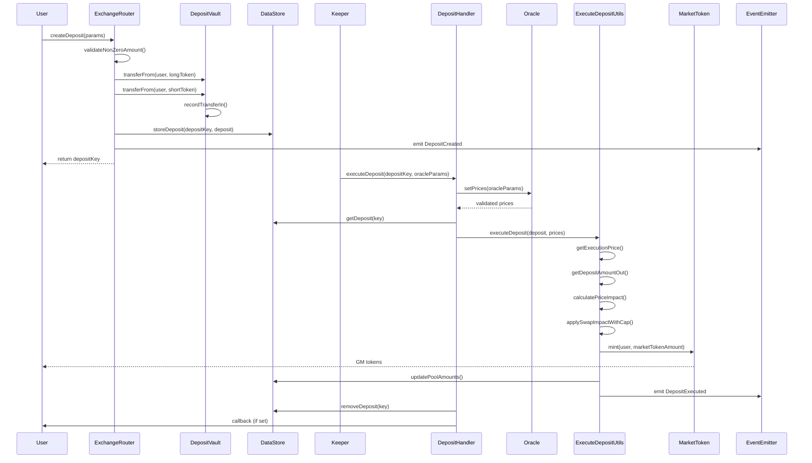

**Code References:**
- `contracts/exchange/ExchangeRouter.sol:271` - `createDeposit()`
- `contracts/exchange/DepositHandler.sol:95` - `executeDeposit()`
- `contracts/deposit/ExecuteDepositUtils.sol:90` - `executeDeposit()`
- `contracts/deposit/DepositStoreUtils.sol` - Deposit storage

### Deposit Data Structure

```solidity
// contracts/deposit/Deposit.sol:24

struct Props {
    Addresses addresses;
    Numbers numbers;
    Flags flags;
}

struct Addresses {
    address account;               // User depositing
    address receiver;             // Receiver of GM tokens
    address callbackContract;     // Optional callback
    address uiFeeReceiver;        // UI fee receiver
    address market;               // Target market
    address initialLongToken;     // Long token deposited
    address initialShortToken;    // Short token deposited
    address[] longTokenSwapPath;  // Swap path for long token
    address[] shortTokenSwapPath; // Swap path for short token
}

struct Numbers {
    uint256 initialLongTokenAmount;  // Long tokens deposited
    uint256 initialShortTokenAmount; // Short tokens deposited
    uint256 minMarketTokens;         // Min GM tokens (slippage)
    uint256 updatedAtBlock;          // Block number
    uint256 executionFee;            // Fee for keeper
    uint256 callbackGasLimit;        // Gas for callback
}
```

**Code Reference:**
- `contracts/deposit/Deposit.sol:24`

### Deposit Amount Calculation

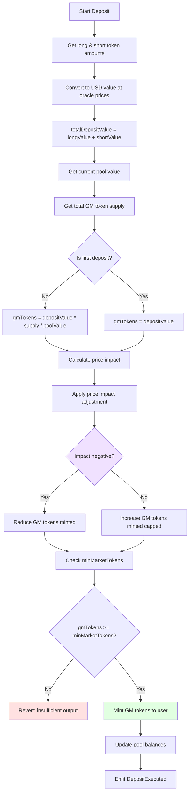

**Code References:**
- `contracts/deposit/ExecuteDepositUtils.sol:260` - `_executeDeposit()`
- `contracts/market/MarketUtils.sol:683` - `getDepositAmountOut()`

**Deposit Formula:**

```solidity
// contracts/market/MarketUtils.sol:683

function getDepositAmountOut(
    DataStore dataStore,
    Market.Props memory market,
    MarketPrices prices,
    uint256 longTokenAmount,
    uint256 shortTokenAmount,
    bool includeVirtualInventoryImpact
) internal view returns (uint256) {
    // Get market value (pool value in USD)
    uint256 poolValue = getPoolValue(dataStore, market, prices);

    // Get GM token supply
    uint256 supply = getMarketTokenSupply(MarketToken(market.marketToken));

    // Calculate deposit value
    uint256 longTokenUsd = longTokenAmount * prices.longTokenPrice.max;
    uint256 shortTokenUsd = shortTokenAmount * prices.shortTokenPrice.max;
    uint256 depositValue = longTokenUsd + shortTokenUsd;

    // Calculate GM tokens to mint
    uint256 marketTokensUsd;
    if (supply == 0) {
        marketTokensUsd = depositValue;
    } else {
        marketTokensUsd = depositValue * supply / poolValue;
    }

    // Apply price impact
    int256 priceImpactUsd = getPriceImpact(/* ... */);
    marketTokensUsd = applyImpact(marketTokensUsd, priceImpactUsd);

    return marketTokensUsd / GM_TOKEN_PRICE; // GM price = $1
}
```

### Deposit with Swaps

Users can deposit tokens that aren't direct market tokens:

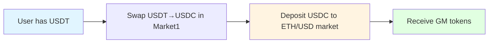

**Example:**
```solidity
createDeposit({
    market: ethUsdMarket,
    initialLongToken: WETH,  // Direct deposit
    initialShortToken: USDT, // Will swap USDT→USDC
    shortTokenSwapPath: [usdtUsdcMarket],
    // ...
});
```

**Code References:**
- `contracts/deposit/ExecuteDepositUtils.sol:160` - `executeDeposit()` with swaps
- `contracts/swap/SwapUtils.sol` - Swap execution

---

## Withdrawal Flow

### Complete Withdrawal Process

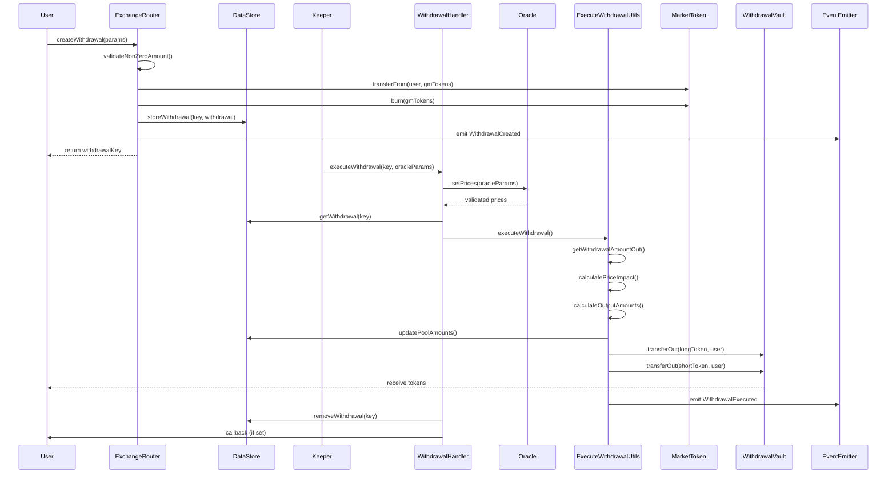

**Code References:**
- `contracts/exchange/ExchangeRouter.sol:309` - `createWithdrawal()`
- `contracts/exchange/WithdrawalHandler.sol:94` - `executeWithdrawal()`
- `contracts/withdrawal/ExecuteWithdrawalUtils.sol:95` - `executeWithdrawal()`

### Withdrawal Data Structure

```solidity
// contracts/withdrawal/Withdrawal.sol:24

struct Props {
    Addresses addresses;
    Numbers numbers;
    Flags flags;
}

struct Addresses {
    address account;
    address receiver;
    address callbackContract;
    address uiFeeReceiver;
    address market;
    address[] longTokenSwapPath;
    address[] shortTokenSwapPath;
}

struct Numbers {
    uint256 marketTokenAmount;       // GM tokens to burn
    uint256 minLongTokenAmount;      // Min long tokens (slippage)
    uint256 minShortTokenAmount;     // Min short tokens (slippage)
    uint256 updatedAtBlock;
    uint256 executionFee;
    uint256 callbackGasLimit;
}
```

**Code Reference:**
- `contracts/withdrawal/Withdrawal.sol:24`

### Withdrawal Amount Calculation

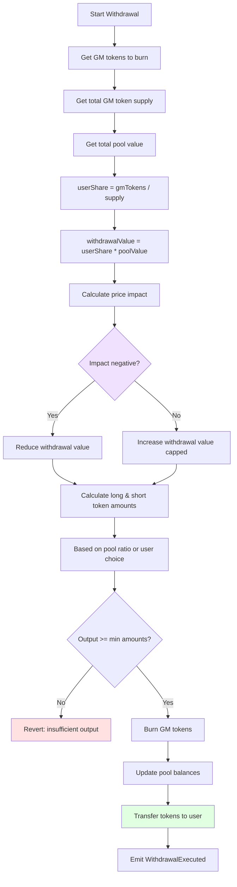

**Code References:**
- `contracts/withdrawal/ExecuteWithdrawalUtils.sol:195` - `_executeWithdrawal()`
- `contracts/market/MarketUtils.sol:835` - `getWithdrawalAmountOut()`

**Withdrawal Formula:**

```solidity
// contracts/market/MarketUtils.sol:835

function getWithdrawalAmountOut(
    DataStore dataStore,
    Market.Props memory market,
    MarketPrices prices,
    uint256 marketTokenAmount,
    address outputToken
) internal view returns (uint256) {
    // Get pool value and GM supply
    uint256 poolValue = getPoolValue(dataStore, market, prices);
    uint256 supply = getMarketTokenSupply(MarketToken(market.marketToken));

    // Calculate withdrawal value
    uint256 marketTokensUsd = marketTokenAmount * GM_TOKEN_PRICE;
    uint256 withdrawalValue = marketTokensUsd * poolValue / supply;

    // Apply price impact
    int256 priceImpactUsd = getPriceImpact(/* ... */);
    withdrawalValue = applyImpact(withdrawalValue, priceImpactUsd);

    // Convert to token amount
    uint256 outputPrice = getTokenPrice(outputToken, prices);
    uint256 outputAmount = withdrawalValue / outputPrice;

    return outputAmount;
}
```

### Withdrawal Output Options

Users can specify how to receive withdrawn liquidity:

**Option 1: Proportional Withdrawal**
```solidity
// Receive both long and short tokens proportionally
createWithdrawal({
    market: ethUsdMarket,
    marketTokenAmount: gmTokens,
    minLongTokenAmount: minWETH,
    minShortTokenAmount: minUSDC,
    // Both > 0: proportional withdrawal
});
```

**Option 2: Single Token Withdrawal**
```solidity
// Receive only long token
createWithdrawal({
    market: ethUsdMarket,
    marketTokenAmount: gmTokens,
    minLongTokenAmount: minWETH,
    minShortTokenAmount: 0,  // 0: receive only long
});
```

**Code References:**
- `contracts/withdrawal/ExecuteWithdrawalUtils.sol:282` - `_getOutputAmounts()`

---

## Market Token Pricing

### GM Token Value Calculation

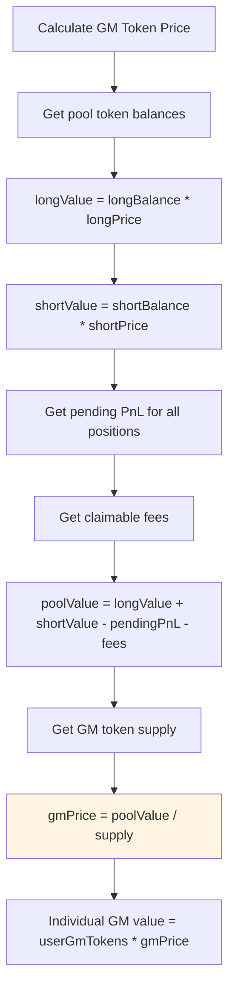

**Code References:**
- `contracts/market/MarketUtils.sol:409` - `getPoolValue()`
- `contracts/market/MarketUtils.sol:568` - `getNetPnl()`
- `contracts/reader/ReaderPricingUtils.sol` - Read GM token info

**Pool Value Formula:**

```solidity
// contracts/market/MarketUtils.sol:409

function getPoolValue(
    DataStore dataStore,
    Market.Props memory market,
    MarketPrices prices
) internal view returns (uint256) {
    // Get token balances
    uint256 longTokenAmount = getPoolAmount(dataStore, market, market.longToken);
    uint256 shortTokenAmount = getPoolAmount(dataStore, market, market.shortToken);

    // Convert to USD
    uint256 longTokenUsd = longTokenAmount * prices.longTokenPrice.max;
    uint256 shortTokenUsd = shortTokenAmount * prices.shortTokenPrice.max;

    // Get total PnL of all positions
    int256 netPnl = getNetPnl(dataStore, market, prices, true);

    // Pool value = tokens - positions PnL
    uint256 poolValue = longTokenUsd + shortTokenUsd;

    if (netPnl > 0) {
        // Traders profitable → reduce pool value
        poolValue = poolValue - uint256(netPnl);
    } else {
        // Traders losing → increase pool value
        poolValue = poolValue + uint256(-netPnl);
    }

    return poolValue;
}
```

### Price Impact on Deposits/Withdrawals

Price impact calculated based on pool imbalance:

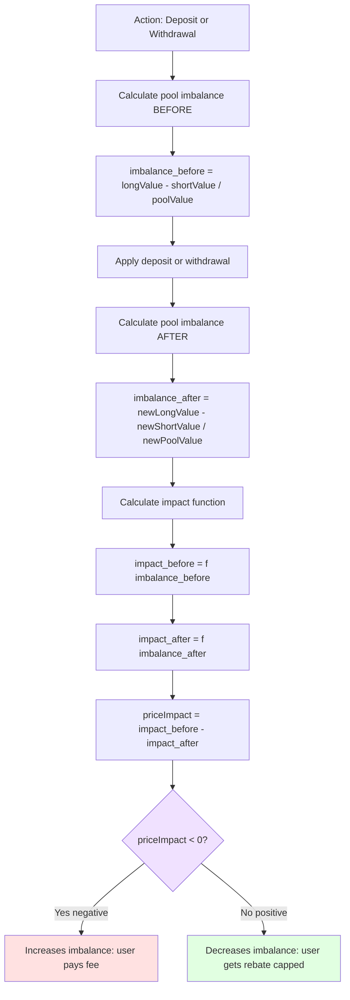

**Code References:**
- `contracts/pricing/SwapPricingUtils.sol:67` - `getPriceImpactUsd()`
- `contracts/market/MarketUtils.sol:1456` - Imbalance calculation

---

## Liquidity Management

### Pool Balance Tracking

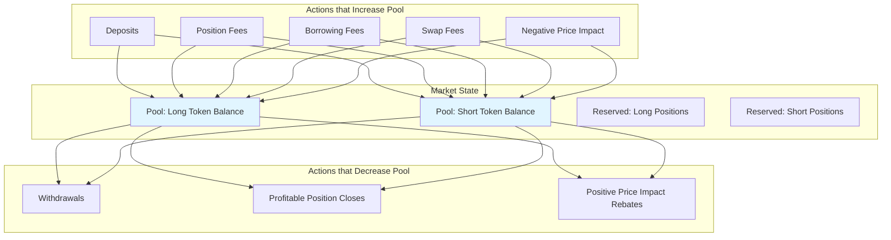

**Code References:**
- `contracts/market/MarketUtils.sol:1865` - `applyDeltaToPoolAmount()`
- `contracts/market/MarketStoreUtils.sol` - Pool amount storage

### Reserved Amounts

Tracking for open positions:

```solidity
// When position opens
reservedAmount += position.sizeInTokens

// When position closes
reservedAmount -= position.sizeInTokens

// Available liquidity = poolAmount - reservedAmount
```

**Code References:**
- `contracts/market/MarketUtils.sol:2055` - `applyDeltaToReservedAmount()`
- `contracts/data/Keys.sol:456` - `RESERVED_USD` key

### Max Pool Utilization

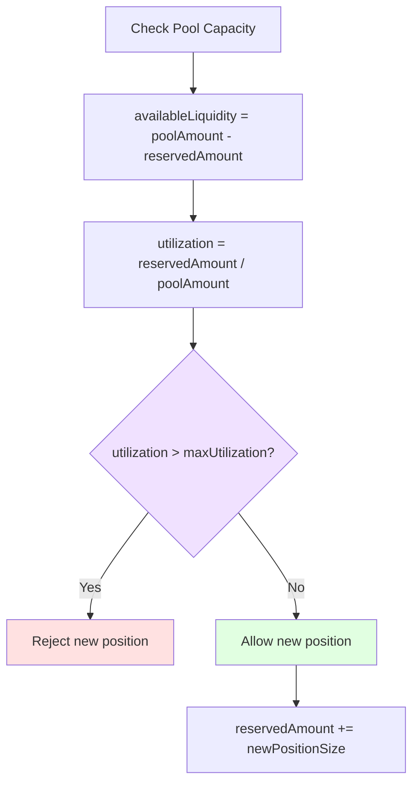

**Configuration:**
```solidity
// Max pool utilization factor (e.g., 90%)
dataStore.setUint(Keys.maxPoolUtilizationFactorKey(market), 0.9e30);
```

**Code References:**
- `contracts/market/MarketUtils.sol:1673` - `validateReserve()`
- `contracts/data/Keys.sol:582` - `MAX_POOL_AMOUNT` key

### Open Interest Tracking

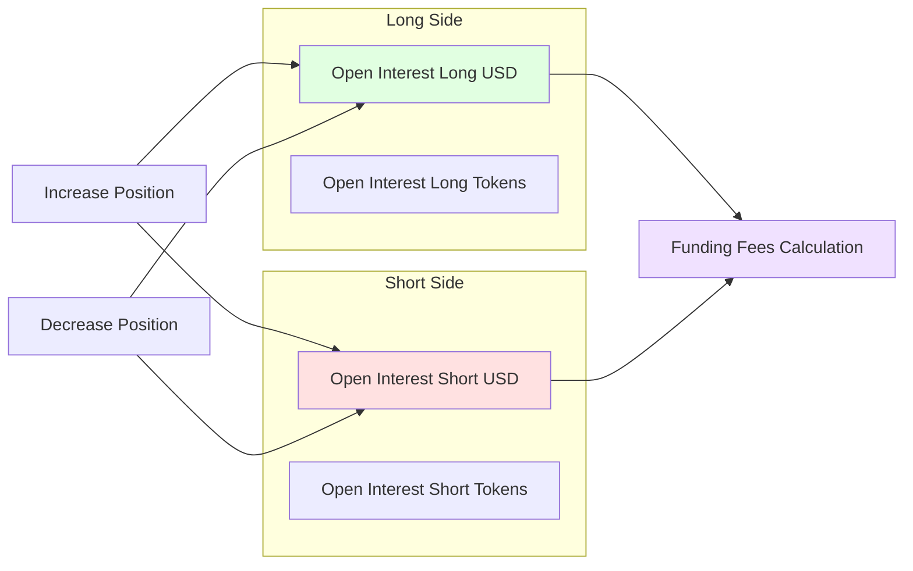

**Code References:**
- `contracts/market/MarketUtils.sol:1943` - `applyDeltaToOpenInterest()`
- `contracts/data/Keys.sol:508` - `OPEN_INTEREST` key

### Position Impact Pool

Special pool for managing price impact distribution:

```solidity
// Negative price impact goes to pool
positionImpactPool += negativePriceImpactAmount

// Positive price impact comes from pool (if available)
if (positionImpactPool >= positiveImpactRebate) {
    positionImpactPool -= positiveImpactRebate
    // Give rebate to user
} else {
    // Cap rebate to available pool
}
```

**Distribution:**
```solidity
// Periodic distribution to LPs
distributionRate = getPositionImpactPoolDistributionRate(market)
amountToDistribute = positionImpactPool * distributionRate * timeDelta

// Move from impact pool to main pool
positionImpactPool -= amountToDistribute
poolAmount += amountToDistribute
```

**Code References:**
- `contracts/market/MarketUtils.sol:1785` - `applyDeltaToPositionImpactPool()`
- `contracts/market/MarketUtils.sol:2136` - `distributePositionImpactPool()`

### Liquidity Caps

Markets have configurable liquidity limits:

```typescript
// config/markets.ts
{
    "ETH/USD": {
        maxLongPoolAmount: "50000", // Max 50k WETH
        maxShortPoolAmount: "100000000", // Max 100M USDC
        maxOpenInterestForLongs: "200000000", // Max $200M long OI
        maxOpenInterestForShorts: "200000000", // Max $200M short OI
    }
}
```

**Code References:**
- `contracts/market/MarketUtils.sol:1592` - `validatePoolAmount()`
- `contracts/market/MarketUtils.sol:1623` - `validateOpenInterest()`

---

## Deposit/Withdrawal Fees

### Fee Structure

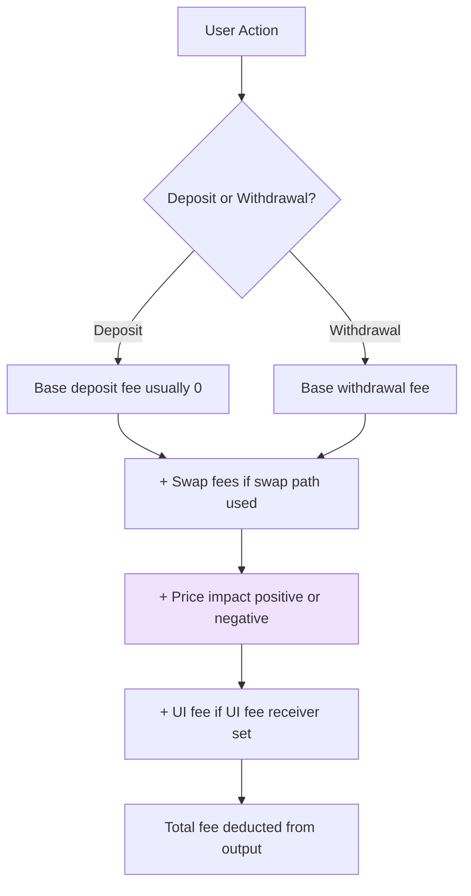

**Fee Configuration:**
```solidity
// Typically deposits have no base fee (incentivize LPs)
depositFee = 0

// Withdrawals may have small fee
withdrawalFee = 0.001e30 // 0.1%

// Swap fees if tokens swapped during deposit/withdrawal
swapFee = 0.0005e30 // 0.05% per swap
```

**Code References:**
- `contracts/fee/FeeUtils.sol` - Fee calculations
- `config/markets.ts` - Fee configurations per market

---

## Related Documentation

- **[ARCHITECTURE.md](./ARCHITECTURE.md)** - System architecture
- **[TRADING_FLOWS.md](./TRADING_FLOWS.md)** - Trading operations
- **[GLV_FLOWS.md](./GLV_FLOWS.md)** - GLV vault operations
- **[PRICING_FLOWS.md](./PRICING_FLOWS.md)** - Pricing mechanisms

---

*Last Updated: 2025-12-01*
