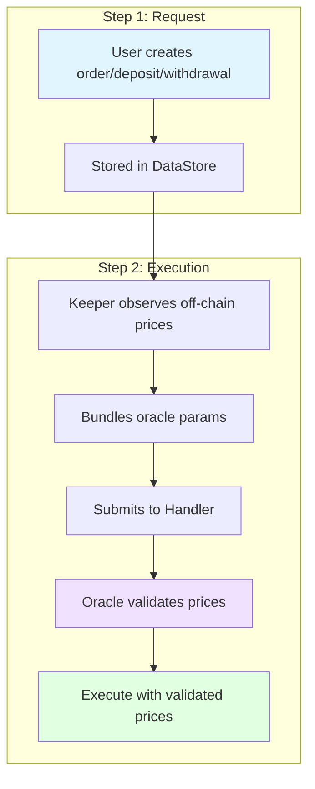
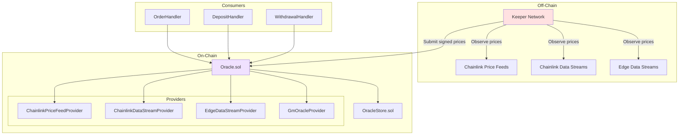
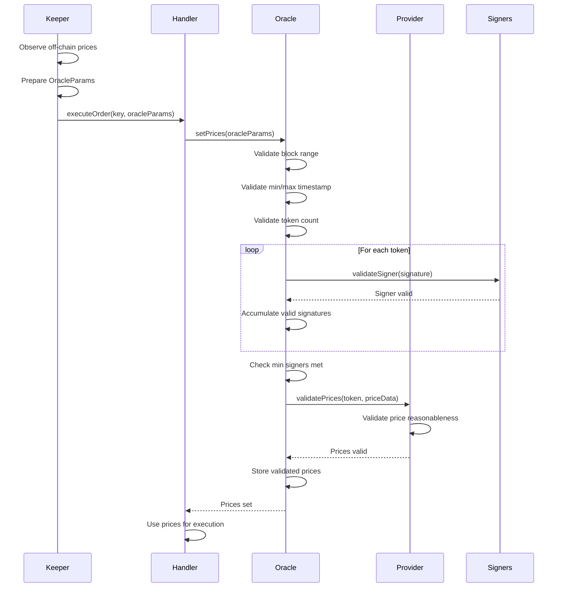
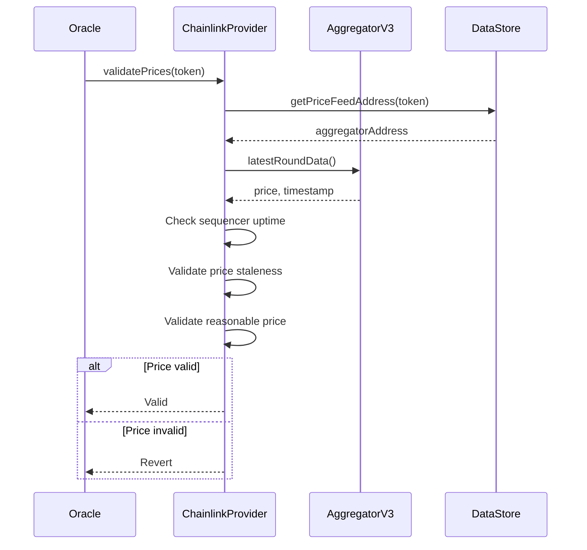
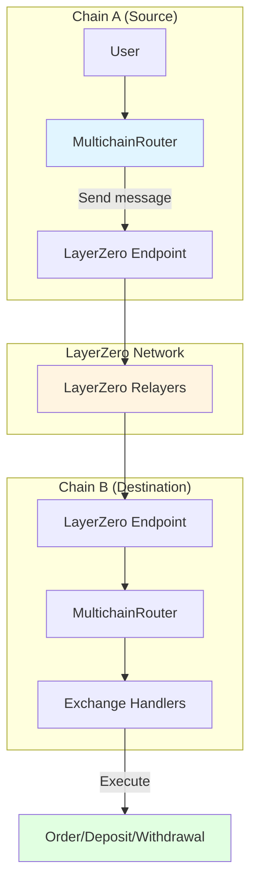
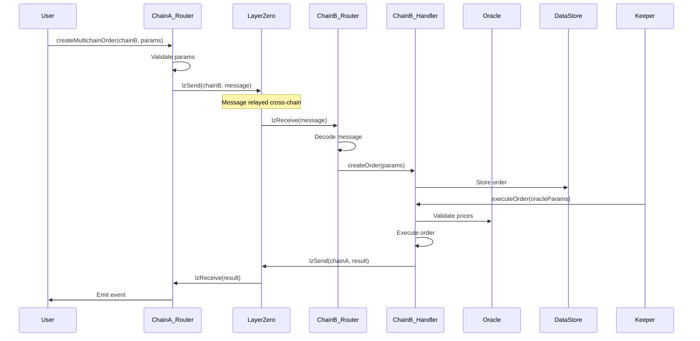
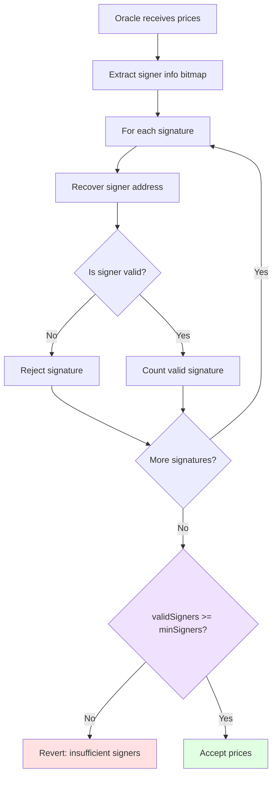

# GMX Synthetics - Oracle & Multichain Flows

## Table of Contents
1. [Oracle System](#oracle-system)
2. [Price Validation](#price-validation)
3. [Oracle Providers](#oracle-providers)
4. [Multichain Operations](#multichain-operations)

---

## Oracle System

### Overview

GMX Synthetics uses a two-step execution model with off-chain oracle prices to prevent front-running:



**Benefits:**
- No on-chain price manipulation
- MEV protection
- Fair execution prices
- Keeper competition ensures timely execution

**Code References:**
- `contracts/oracle/Oracle.sol:242` - Main oracle contract
- `contracts/oracle/OracleUtils.sol` - Oracle utilities

### Oracle Architecture



**Code References:**
- `contracts/oracle/Oracle.sol:242` - Central oracle
- `contracts/oracle/OracleStore.sol` - Oracle configuration
- `contracts/oracle/OracleUtils.sol:78` - Price validation

---

## Price Validation

### Oracle Price Submission Flow



**Code References:**
- `contracts/oracle/Oracle.sol:298` - `setPrices()`
- `contracts/oracle/OracleUtils.sol:180` - `validateSigner()`
- `contracts/oracle/OracleUtils.sol:78` - `validateBlockNumberWithinRange()`

### Price Data Structure

```solidity
// contracts/oracle/Oracle.sol

struct SetPricesParams {
    uint256 signerInfo;           // Bitmap of signer indices
    address[] tokens;             // Tokens to set prices for
    uint256[] compactedMinOracleBlockNumbers;
    uint256[] compactedMaxOracleBlockNumbers;
    uint256[] compactedOracleTimestamps;
    uint256[] compactedDecimals;
    uint256[] compactedMinPrices;
    uint256[] compactedMinPricesIndexes;
    uint256[] compactedMaxPrices;
    uint256[] compactedMaxPricesIndexes;
    bytes[] signatures;           // Signer signatures
    address[] priceFeedTokens;    // External price feed tokens
    address[] realtimeFeedTokens; // Realtime feed tokens
    bytes[] realtimeFeedData;     // Data for realtime feeds
}
```

**Code Reference:**
- `contracts/oracle/Oracle.sol:80` - `SetPricesParams` struct

### Price Compaction

Prices are compacted to save gas:

```solidity
// contracts/price/PriceUtils.sol

// Compact format: uint8 multiplier + uint32 price value
// Actual price = value * 10^multiplier

function compactPrice(uint256 price) returns (uint256) {
    // Find optimal multiplier
    uint8 multiplier = 0;
    uint256 value = price;

    while (value > type(uint32).max && multiplier < 255) {
        value = value / 10;
        multiplier++;
    }

    // Pack: multiplier (8 bits) + value (32 bits)
    return (uint256(multiplier) << 32) | uint256(value);
}

function decompactPrice(uint256 compacted) returns (uint256) {
    uint8 multiplier = uint8(compacted >> 32);
    uint32 value = uint32(compacted);
    return uint256(value) * (10 ** multiplier);
}
```

**Code References:**
- `contracts/oracle/OracleUtils.sol:253` - `getUncompactedPrice()`
- `contracts/oracle/OracleUtils.sol:325` - Price decompaction logic

### Min/Max Prices

Oracle provides both min and max prices for safer execution:

```solidity
struct Price {
    uint256 min;  // Minimum price (conservative for sells)
    uint256 max;  // Maximum price (conservative for buys)
}

// Usage:
// - Buying/Increasing: use max price (worse for user)
// - Selling/Decreasing: use min price (worse for user)
// - Conservative pricing protects against price volatility
```

**Example:**
```
Token: WETH
Oracle Min Price: $2,995
Oracle Max Price: $3,005
Price spread: $10 (volatility protection)

User buys WETH: charged $3,005 (max price)
User sells WETH: receives $2,995 (min price)
Spread protects LPs from adverse selection
```

**Code References:**
- `contracts/price/Price.sol` - Price struct
- `contracts/oracle/Oracle.sol:414` - `getPrimaryPrice()`

---

## Oracle Providers

### Chainlink Price Feed Provider

Uses Chainlink on-chain price feeds as fallback/validation:



**Code References:**
- `contracts/oracle/ChainlinkPriceFeedProvider.sol:35` - `validate()`
- `contracts/oracle/ChainlinkPriceFeedProvider.sol:74` - `validateSequencerUp()`

**Sequencer Check:**
```solidity
// Check L2 sequencer is up (for Arbitrum, Optimism, etc.)
function validateSequencerUp() internal view {
    (, int256 answer, uint256 startedAt, , ) = sequencerUptimeFeed.latestRoundData();

    // answer == 0: sequencer is up
    // answer == 1: sequencer is down
    if (answer != 0) {
        revert Errors.SequencerDown();
    }

    // Grace period after sequencer comes back up
    uint256 timeSinceUp = block.timestamp - startedAt;
    if (timeSinceUp < GRACE_PERIOD) {
        revert Errors.GracePeriodNotOver();
    }
}
```

**Code Reference:**
- `contracts/oracle/ChainlinkPriceFeedProvider.sol:74`

### Chainlink Data Stream Provider

Uses Chainlink Data Streams (low-latency oracle):

```solidity
// contracts/oracle/ChainlinkDataStreamProvider.sol

function validate(
    address token,
    bytes memory data
) external view returns (bool) {
    // Decode Data Streams report
    bytes32 feedId = getFeedId(token);
    (
        bytes32[] memory reportFeedIds,
        bytes memory signedReport
    ) = abi.decode(data, (bytes32[], bytes));

    // Verify report
    IVerifierProxy(verifierProxy).verify(signedReport);

    // Extract price from report
    Report memory report = abi.decode(signedReport, (Report));

    // Validate price
    validateReasonablePrice(token, report.price);

    return true;
}
```

**Code References:**
- `contracts/oracle/ChainlinkDataStreamProvider.sol` - Data streams integration
- External: Chainlink Data Streams documentation

### Edge Data Stream Provider

Integration with Edge oracle network:

```solidity
// contracts/oracle/EdgeDataStreamProvider.sol

function validate(
    address token,
    bytes memory data
) external view returns (bool) {
    // Decode Edge oracle data
    (
        uint256 price,
        uint256 timestamp,
        bytes[] memory signatures
    ) = abi.decode(data, (uint256, uint256, bytes[]));

    // Verify signatures from Edge validators
    validateEdgeSignatures(signatures, price, timestamp);

    // Validate price freshness
    require(
        block.timestamp - timestamp < MAX_PRICE_AGE,
        "Price too old"
    );

    return true;
}
```

**Code References:**
- `contracts/oracle/EdgeDataStreamProvider.sol` - Edge integration

### GM Oracle Provider

Special provider for GM token pricing:

```solidity
// contracts/oracle/GmOracleProvider.sol

function getGmPrice(
    address market,
    MarketPrices prices
) internal view returns (uint256) {
    // Get pool value
    uint256 poolValue = MarketUtils.getPoolValue(
        dataStore,
        market,
        prices
    );

    // Get GM supply
    uint256 supply = MarketToken(market).totalSupply();

    // GM price = poolValue / supply
    return poolValue * PRECISION / supply;
}
```

**Code References:**
- `contracts/oracle/GmOracleProvider.sol` - GM token pricing
- `contracts/market/MarketUtils.sol:409` - Pool value calculation

---

## Multichain Operations

### LayerZero Integration

GMX Synthetics supports cross-chain operations via LayerZero:



**Code References:**
- `contracts/multichain/MultichainRouter.sol` - Cross-chain router
- `contracts/multichain/LayerZeroProvider.sol` - LayerZero integration

### Cross-Chain Order Flow



**Code References:**
- `contracts/multichain/MultichainOrderRouter.sol` - Cross-chain orders
- `contracts/multichain/MultichainGmRouter.sol` - Cross-chain GM operations
- `contracts/multichain/MultichainGlvRouter.sol` - Cross-chain GLV operations

### Multichain Message Structure

```solidity
// contracts/multichain/MultichainUtils.sol

struct MultichainMessage {
    address sender;           // Sender on source chain
    address receiver;         // Receiver on destination chain
    uint8 messageType;        // Order, deposit, withdrawal, etc.
    bytes payload;            // Encoded action params
    uint256 executionFee;     // Fee for destination execution
    uint256 bridgeAmount;     // Amount bridged (if any)
}

enum MessageType {
    CREATE_ORDER,
    CREATE_DEPOSIT,
    CREATE_WITHDRAWAL,
    CLAIM_FUNDING_FEES,
    CLAIM_COLLATERAL
}
```

**Code References:**
- `contracts/multichain/MultichainUtils.sol` - Message structures
- `contracts/multichain/LayerZeroProvider.sol:82` - Message encoding/decoding

### Supported Multichain Operations

**1. Cross-Chain Orders**
```solidity
// Create order on different chain
multichainOrderRouter.createMultichainOrder({
    dstChainId: ARBITRUM,
    orderParams: params,
    executionFee: fee
});
```

**2. Cross-Chain GM Deposits**
```solidity
// Deposit to GM market on different chain
multichainGmRouter.createMultichainDeposit({
    dstChainId: AVALANCHE,
    market: avaxMarket,
    depositParams: params
});
```

**3. Cross-Chain GLV Operations**
```solidity
// Deposit to GLV on different chain
multichainGlvRouter.createMultichainGlvDeposit({
    dstChainId: ARBITRUM,
    glv: glvEthUsdc,
    depositParams: params
});
```

**4. Cross-Chain Claims**
```solidity
// Claim funding fees on different chain
multichainClaimsRouter.claimFundingFees({
    dstChainId: ARBITRUM,
    markets: markets,
    tokens: tokens
});
```

**Code References:**
- `contracts/multichain/MultichainOrderRouter.sol` - Cross-chain orders
- `contracts/multichain/MultichainGmRouter.sol` - Cross-chain GM
- `contracts/multichain/MultichainGlvRouter.sol` - Cross-chain GLV
- `contracts/multichain/MultichainClaimsRouter.sol` - Cross-chain claims

### LayerZero Configuration

```typescript
// config/layerZero.ts

export const layerZero = {
    endpoints: {
        arbitrum: "0x1a44076050125825900e736c501f859c50fE728c",
        avalanche: "0x1a44076050125825900e736c501f859c50fE728c",
        // ...
    },
    chainIds: {
        arbitrum: 110,
        avalanche: 106,
        // ...
    }
}
```

**Code Reference:**
- `config/layerZero.ts` - LayerZero configuration

### Cross-Chain Gas Estimation

```solidity
// Estimate gas for cross-chain message
function estimateMultichainFee(
    uint16 dstChainId,
    bytes memory payload
) external view returns (uint256 nativeFee, uint256 zroFee) {
    return lzEndpoint.estimateFees(
        dstChainId,
        address(this),
        payload,
        false,
        bytes("")
    );
}
```

**Code References:**
- `contracts/multichain/LayerZeroProvider.sol:145` - Fee estimation
- `contracts/gas/GasUtils.sol` - Gas utilities

---

## Oracle Security

### Multi-Signer Validation



**Configuration:**
```solidity
// Minimum signers required (e.g., 3 out of 5)
minOracleSigners = 3

// Valid signer addresses
oracleSigners = [signer1, signer2, signer3, signer4, signer5]
```

**Code References:**
- `contracts/oracle/OracleUtils.sol:180` - `validateSigner()`
- `config/oracle.ts` - Oracle signer configuration

### Price Reasonableness Checks

```solidity
// Validate price is within reasonable bounds
function validateReasonablePrice(
    address token,
    uint256 price
) internal view {
    // Get reference price from Chainlink
    uint256 chainlinkPrice = getChainlinkPrice(token);

    // Calculate deviation
    uint256 deviation = price > chainlinkPrice
        ? price - chainlinkPrice
        : chainlinkPrice - price;

    uint256 deviationPercent = deviation * PRECISION / chainlinkPrice;

    // Revert if deviation too high (e.g., > 5%)
    require(
        deviationPercent < MAX_PRICE_DEVIATION,
        "Price deviation too high"
    );
}
```

**Code References:**
- `contracts/oracle/OracleUtils.sol` - Price validation utilities

---

## Related Documentation

- **[ARCHITECTURE.md](./ARCHITECTURE.md)** - System architecture
- **[TRADING_FLOWS.md](./TRADING_FLOWS.md)** - How oracle prices are used
- **[PRICING_FLOWS.md](./PRICING_FLOWS.md)** - Price-based calculations
- **[COMPONENTS.md](./COMPONENTS.md)** - Oracle components reference

---

*Last Updated: 2025-12-01*
