# GMX Synthetics - Pricing Flows

## Table of Contents
1. [Price Impact Mechanism](#price-impact-mechanism)
2. [Funding Fees](#funding-fees)
3. [Borrowing Fees](#borrowing-fees)
4. [Position Fees](#position-fees)
5. [Fee Distribution](#fee-distribution)

---

## Price Impact Mechanism

### Overview

Price impact is a dynamic fee/rebate mechanism that:
- **Discourages** actions that increase pool imbalance (negative impact = fee)
- **Encourages** actions that decrease pool imbalance (positive impact = rebate)
- Maintains balanced pools
- Protects LPs from adverse selection

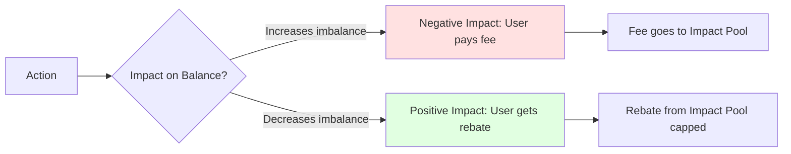

### Price Impact Calculation Flow

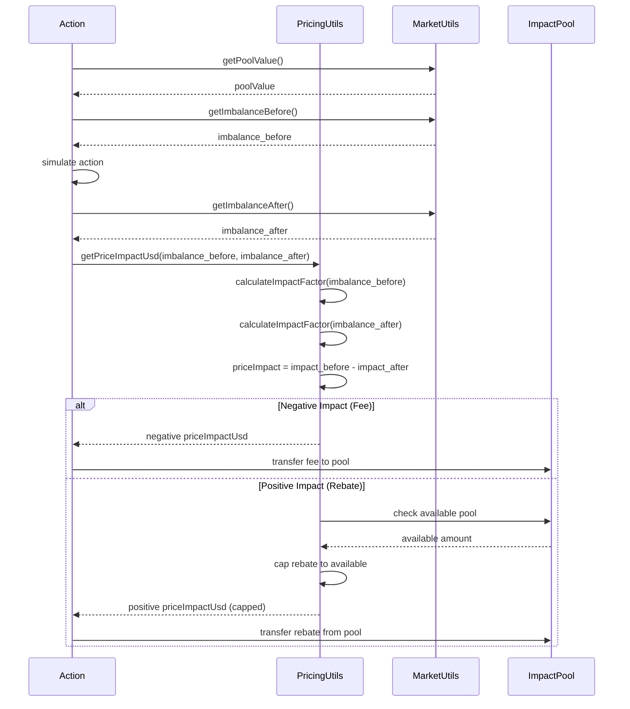

**Code References:**
- `contracts/pricing/PositionPricingUtils.sol:89` - `getPriceImpactUsd()`
- `contracts/pricing/SwapPricingUtils.sol:67` - Swap price impact
- `contracts/pricing/PricingUtils.sol` - Impact formulas

### Price Impact Formula

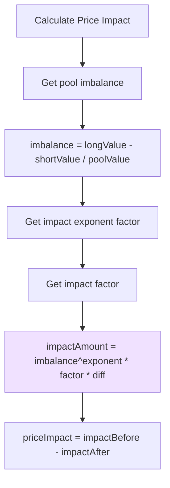

**Mathematical Formula:**

```solidity
// contracts/pricing/PricingUtils.sol

// Imbalance calculation
imbalance = (longTokenUsd - shortTokenUsd) / poolValueUsd

// Impact function (nonlinear)
impact = sign(imbalance) * |imbalance|^exponent * impactFactor * diffUsd

// Price impact
priceImpact = impactBefore - impactAfter

// If priceImpact < 0: user pays (increases imbalance)
// If priceImpact > 0: user gets rebate (decreases imbalance, capped)
```

**Code References:**
- `contracts/pricing/PricingUtils.sol:89` - `applyImpactFactor()`
- `contracts/market/MarketUtils.sol:1456` - `getPoolUsdWithoutPnl()`

### Price Impact for Different Actions

#### Swap Price Impact

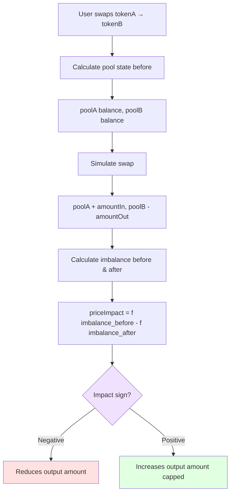

**Example:**
```
Market: ETH/USD (WETH, USDC)
Pool: 100 WETH ($300k), 200k USDC ($200k)
Imbalance: ($300k - $200k) / $500k = 0.2 (20% skewed to long)

Swap: 10 WETH → USDC
- Increases long token (bad for imbalance)
- Negative price impact → user pays fee
- Output USDC reduced

Swap: 20k USDC → WETH
- Decreases long token (good for imbalance)
- Positive price impact → user gets rebate (capped)
- Output WETH increased
```

**Code References:**
- `contracts/pricing/SwapPricingUtils.sol:67` - `getPriceImpactUsd()`
- `contracts/swap/SwapUtils.sol:152` - Apply impact to swap

#### Position Price Impact

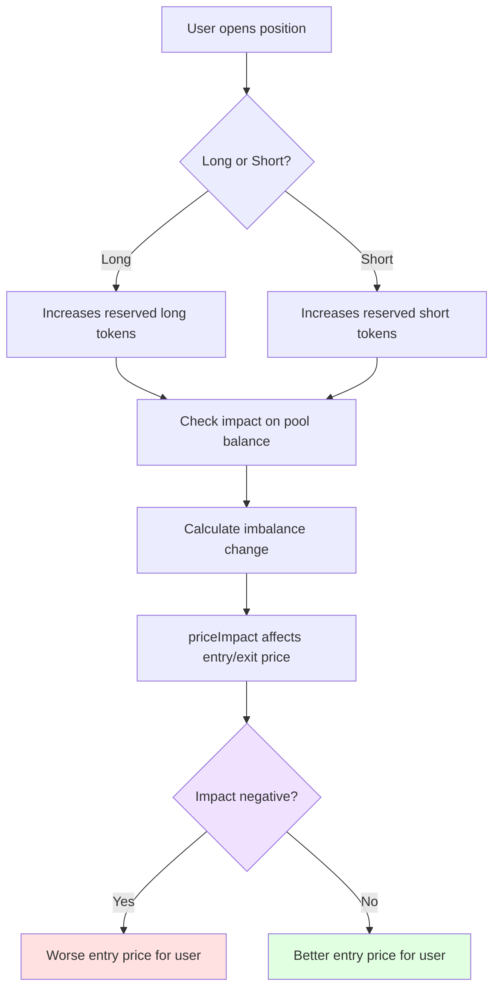

**Example:**
```
Open Long Position:
- Reserves long token (WETH)
- If long side already heavy → negative impact
- Entry price worse (pay more)

Close Long Position:
- Releases long token (WETH)
- If long side heavy → positive impact
- Exit price better (receive more), but capped
```

**Code References:**
- `contracts/pricing/PositionPricingUtils.sol:89` - `getPriceImpactUsd()`
- `contracts/position/IncreasePositionUtils.sol` - Apply to position open
- `contracts/position/DecreasePositionUtils.sol` - Apply to position close

### Virtual Inventory

Prevents gaming by tracking cumulative imbalance across actions:

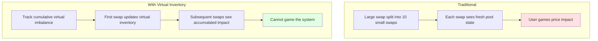

**Virtual Inventory Update:**

```solidity
// contracts/market/MarketUtils.sol

// Get current virtual inventory
int256 virtualInventory = getVirtualInventory(dataStore, market, token);

// After action, update it
int256 impactAmount = calculateImpactAmount(/* ... */);
int256 newVirtualInventory = virtualInventory + impactAmount;

// Store updated virtual inventory
setVirtualInventory(dataStore, market, token, newVirtualInventory);
```

**Code References:**
- `contracts/market/MarketUtils.sol:2387` - `applyDeltaToVirtualInventory()`
- `contracts/pricing/PricingUtils.sol` - Virtual inventory in impact calculation

### Position Impact Pool

Special pool that receives negative price impact fees and pays positive impact rebates:

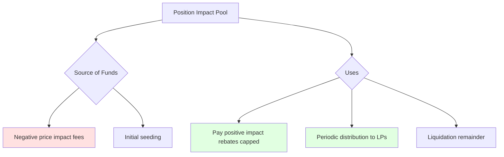

**Distribution Mechanism:**

```solidity
// contracts/market/MarketUtils.sol:2136

function distributePositionImpactPool(
    DataStore dataStore,
    address market,
    address token
) internal {
    // Get impact pool balance
    uint256 impactPoolAmount = getPositionImpactPoolAmount(dataStore, market, token);

    // Get distribution rate (e.g., 0.5% per hour)
    uint256 distributionRate = getPositionImpactPoolDistributionRate(dataStore, market);

    // Calculate amount to distribute
    uint256 distributionAmount = impactPoolAmount * distributionRate / PRECISION;

    // Transfer from impact pool to main pool
    applyDeltaToPositionImpactPool(dataStore, market, token, -distributionAmount);
    applyDeltaToPoolAmount(dataStore, market, token, distributionAmount);
}
```

**Code References:**
- `contracts/market/MarketUtils.sol:1785` - `applyDeltaToPositionImpactPool()`
- `contracts/market/MarketUtils.sol:2136` - Distribution logic

---

## Funding Fees

### Purpose

Funding fees balance long/short ratio by making the larger side pay the smaller side.

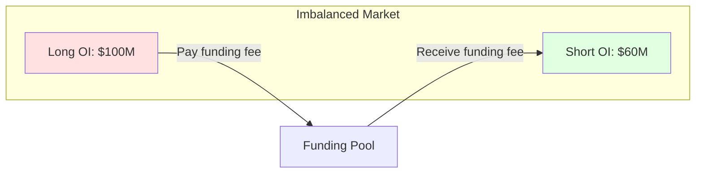

**Key Characteristics:**
- Accrues continuously (per second)
- Paid by larger side to smaller side
- Rate proportional to imbalance
- Claimable by profitable side

### Funding Fee Calculation

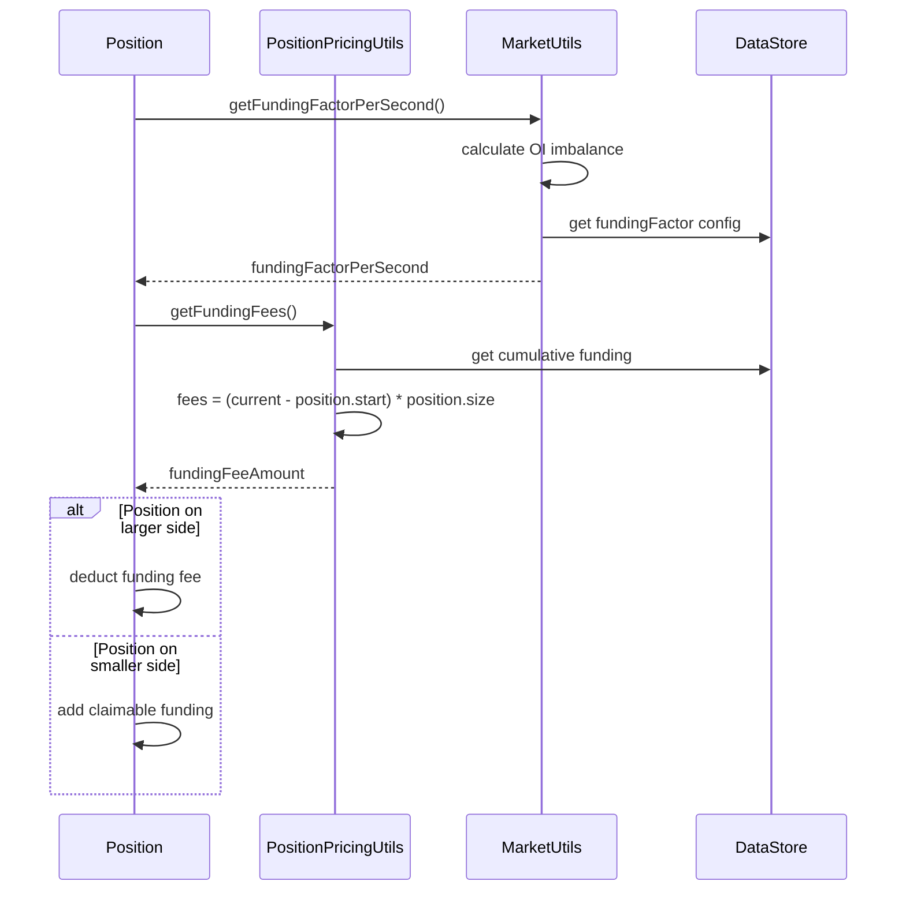

**Code References:**
- `contracts/pricing/PositionPricingUtils.sol:246` - `getFundingFees()`
- `contracts/market/MarketUtils.sol:1231` - `getNextFundingAmountPerSize()`

**Funding Formula:**

```solidity
// contracts/market/MarketUtils.sol:1231

function getFundingFactorPerSecond(
    DataStore dataStore,
    address market,
    bool isLong
) internal view returns (uint256) {
    // Get open interest for both sides
    uint256 longOI = getOpenInterest(dataStore, market, true);
    uint256 shortOI = getOpenInterest(dataStore, market, false);

    // Calculate imbalance
    uint256 diffOI = longOI > shortOI ? longOI - shortOI : shortOI - longOI;
    uint256 totalOI = longOI + shortOI;

    if (totalOI == 0) return 0;

    // Funding factor based on imbalance
    uint256 fundingFactor = dataStore.getUint(Keys.fundingFactorKey(market));

    // fundingPerSecond = (diffOI / totalOI) * fundingFactor
    uint256 fundingPerSecond = (diffOI * fundingFactor) / totalOI;

    return fundingPerSecond;
}

// Per-position funding fee
fundingFee = position.sizeInUsd * fundingFactorPerSecond * timeDelta
```

**Example:**
```
Market: ETH/USD
Long OI: $100M
Short OI: $60M
Total OI: $160M
Imbalance: $40M (long side larger)

fundingFactor: 0.0000001 per second (configured)
fundingRate = (40M / 160M) * 0.0000001 = 0.000000025 per second

For $10k long position over 1 hour (3600 seconds):
fundingFee = $10,000 * 0.000000025 * 3600 = $0.90

Long position pays $0.90/hour
Short positions claim this proportionally
```

### Funding Fee Tracking

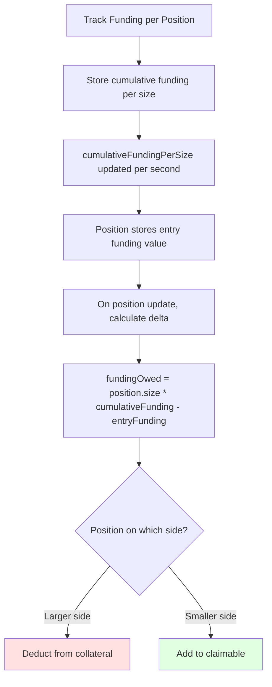

**Code References:**
- `contracts/position/Position.sol:29` - Position funding tracking fields
- `contracts/market/MarketUtils.sol:1322` - Update cumulative funding

### Claiming Funding Fees

Users on profitable side (smaller OI) can claim accrued funding:

```solidity
// User claims funding fees
ExchangeRouter.claimFundingFees(markets, tokens, receiver);

// Contract:
// 1. Calculate claimable amount for user's positions
// 2. Transfer tokens to receiver
// 3. Update claimed amount
```

**Code References:**
- `contracts/exchange/ExchangeRouter.sol:428` - `claimFundingFees()`
- `contracts/position/PositionUtils.sol` - Funding claim logic

---

## Borrowing Fees

### Purpose

Borrowing fees compensate LPs for position traders using their liquidity.

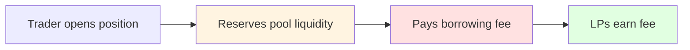

**Characteristics:**
- Based on pool utilization
- Accrues continuously
- Paid to LPs (increases pool value)
- Different rates for long/short sides

### Borrowing Fee Calculation

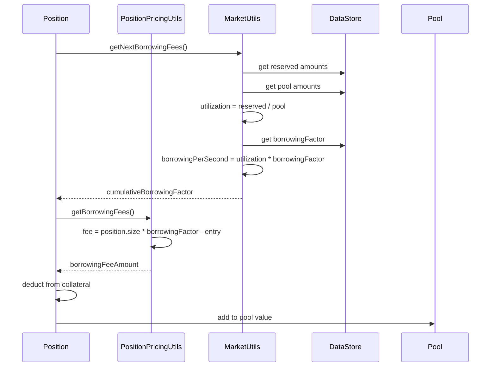

**Code References:**
- `contracts/pricing/PositionPricingUtils.sol:317` - `getBorrowingFees()`
- `contracts/market/MarketUtils.sol:1058` - `getNextCumulativeBorrowingFactor()`

**Borrowing Formula:**

```solidity
// contracts/market/MarketUtils.sol:1058

function getNextCumulativeBorrowingFactor(
    DataStore dataStore,
    address market,
    bool isLong
) internal view returns (uint256) {
    // Get pool utilization
    uint256 reservedUsd = getReservedUsd(dataStore, market, isLong);
    uint256 poolUsd = getPoolUsd(dataStore, market, isLong);

    if (poolUsd == 0) return 0;

    uint256 utilization = reservedUsd * PRECISION / poolUsd;

    // Get borrowing factor
    uint256 borrowingFactor = dataStore.getUint(
        Keys.borrowingFactorKey(market, isLong)
    );

    // borrowingPerSecond = utilization * borrowingFactor
    uint256 borrowingPerSecond = utilization * borrowingFactor / PRECISION;

    // Accumulate over time
    uint256 timeDelta = block.timestamp - lastUpdate;
    uint256 newBorrowingFactor = currentFactor + (borrowingPerSecond * timeDelta);

    return newBorrowingFactor;
}

// Per-position borrowing fee
borrowingFee = position.sizeInUsd * (currentFactor - position.borrowingFactor)
```

**Example:**
```
Market: ETH/USD
Pool Long: 1000 WETH ($3M)
Reserved Long: 500 WETH ($1.5M)
Utilization: 50%

borrowingFactor: 0.0000001 per second (configured)
borrowingRate = 0.5 * 0.0000001 = 0.00000005 per second

For $10k long position over 24 hours (86400 seconds):
borrowingFee = $10,000 * 0.00000005 * 86400 = $43.20

Position pays $43.20/day to LPs
```

### Borrowing Fee Impact

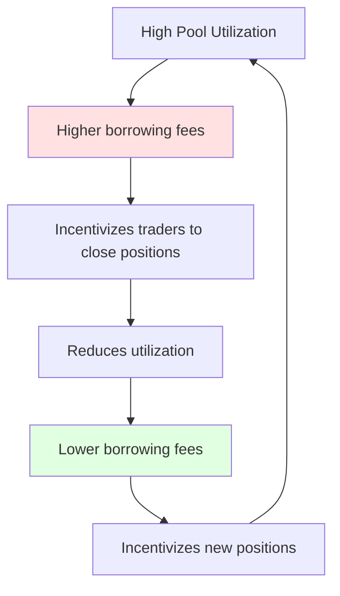

**Code References:**
- `contracts/market/MarketUtils.sol:1135` - Borrowing factor update
- `contracts/position/PositionUtils.sol` - Apply borrowing fees to position

---

## Position Fees

### Fee Components

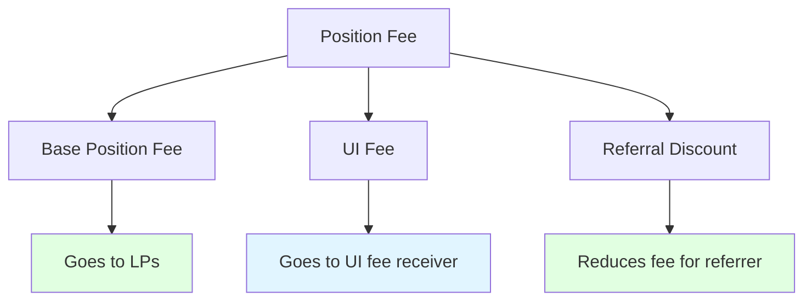

### Position Fee Calculation

```solidity
// contracts/pricing/PositionPricingUtils.sol

struct PositionFees {
    PositionReferralFees referral;
    PositionFundingFees funding;
    PositionBorrowingFees borrowing;
    PositionUiFees ui;
    Price.Props collateralTokenPrice;
    uint256 positionFeeFactor;
    uint256 protocolFeeAmount;
    uint256 positionFeeReceiverFactor;
    uint256 feeReceiverAmount;
    uint256 feeAmountForPool;
    uint256 positionFeeAmountForPool;
    uint256 positionFeeAmount;
    uint256 totalCostAmountExcludingFunding;
    uint256 totalCostAmount;
}

function getPositionFees(
    GetPositionFeesParams memory params
) internal view returns (PositionFees memory) {
    // Base position fee
    uint256 positionFeeAmount = params.sizeDeltaUsd * positionFeeFactor / PRECISION;

    // UI fee
    uint256 uiFeeAmount = positionFeeAmount * uiFeeReceiver != 0 ? uiFactor : 0;

    // Referral discount
    uint256 referralDiscount = calculateReferralDiscount(params.account);
    positionFeeAmount -= referralDiscount;

    // Total fee
    uint256 totalFee = positionFeeAmount + borrowingFee + fundingFee + priceImpact;

    return fees;
}
```

**Code References:**
- `contracts/pricing/PositionPricingUtils.sol:163` - `getPositionFees()`
- `contracts/fee/FeeUtils.sol` - Fee calculations

### Fee Breakdown Example

```
Open $10,000 position:

Base Position Fee (0.1%): $10
Borrowing Fee (accrued): $0
Funding Fee (accrued): $0
Price Impact: -$15 (negative)
UI Fee (10% of base): $1
Referral Discount: -$2

Total Fee at Open: $10 - $2 + $15 + $1 = $24

After 24 hours:
Base Fee: $0 (only on open/close)
Borrowing Fee: $43.20
Funding Fee: $21.60
Price Impact on Close: +$10 (positive, capped)

Total Fee to Close: $10 (position fee) + $43.20 + $21.60 - $10 = $64.80
```

---

## Fee Distribution

### Fee Flow Diagram

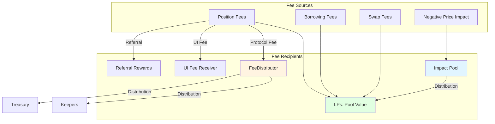

**Code References:**
- `contracts/fee/FeeHandler.sol` - Fee collection
- `contracts/fee/FeeDistributor.sol` - Fee distribution

### Fee Distribution Configuration

```typescript
// config/markets.ts

{
    "ETH/USD": {
        // Position fees
        positionFeeFactor: "0.0005", // 0.05%
        positionImpactExponentFactor: "2.0",

        // Swap fees
        swapFeeFactor: "0.0005", // 0.05%

        // Borrowing fees
        borrowingFactor: "0.00000001", // per second

        // Funding fees
        fundingFactor: "0.00000005", // per second

        // Fee receivers
        feeReceiverFactor: "0.1", // 10% to protocol

        // Impact pool
        positionImpactPoolDistributionRate: "0.01", // 1% per interval
    }
}
```

**Code References:**
- `config/markets.ts` - Fee configurations
- `contracts/data/Keys.sol` - Fee configuration keys

---

## Related Documentation

- **[ARCHITECTURE.md](./ARCHITECTURE.md)** - System architecture
- **[TRADING_FLOWS.md](./TRADING_FLOWS.md)** - How fees apply to trades
- **[LIQUIDITY_FLOWS.md](./LIQUIDITY_FLOWS.md)** - LP fee earnings
- **[ORACLE_FLOWS.md](./ORACLE_FLOWS.md)** - Price data for fees

---

*Last Updated: 2025-12-01*
