# GMX Synthetics - Trading Flows

## Table of Contents
1. [Order Lifecycle](#order-lifecycle)
2. [Position Management](#position-management)
3. [Swap Operations](#swap-operations)
4. [Liquidations](#liquidations)
5. [Auto-Deleveraging (ADL)](#auto-deleveraging-adl)

---

## Order Lifecycle

### Order Creation Flow

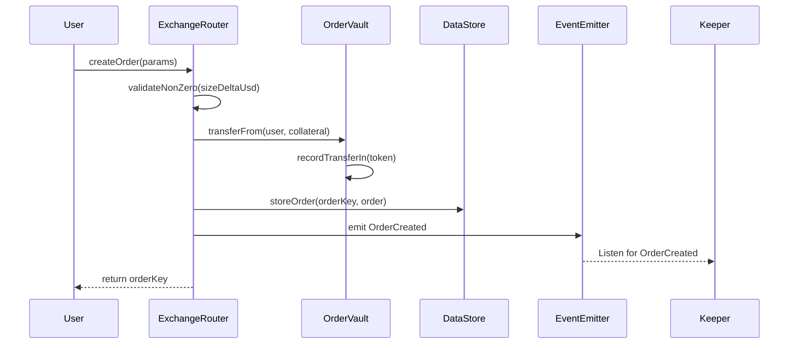

**Code References:**
- `contracts/exchange/ExchangeRouter.sol:192` - `createOrder()`
- `contracts/order/OrderStoreUtils.sol:41` - `set()` (store order)
- `contracts/order/BaseOrderUtils.sol:73` - `createOrder()`

### Order Execution Flow

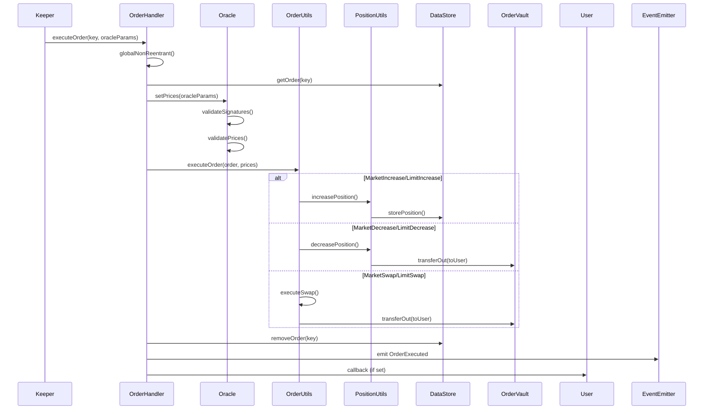

**Code References:**
- `contracts/exchange/OrderHandler.sol:84` - `executeOrder()`
- `contracts/order/BaseOrderUtils.sol:206` - `executeOrder()`
- `contracts/order/OrderUtils.sol:125` - Order type routing

### Order State Machine

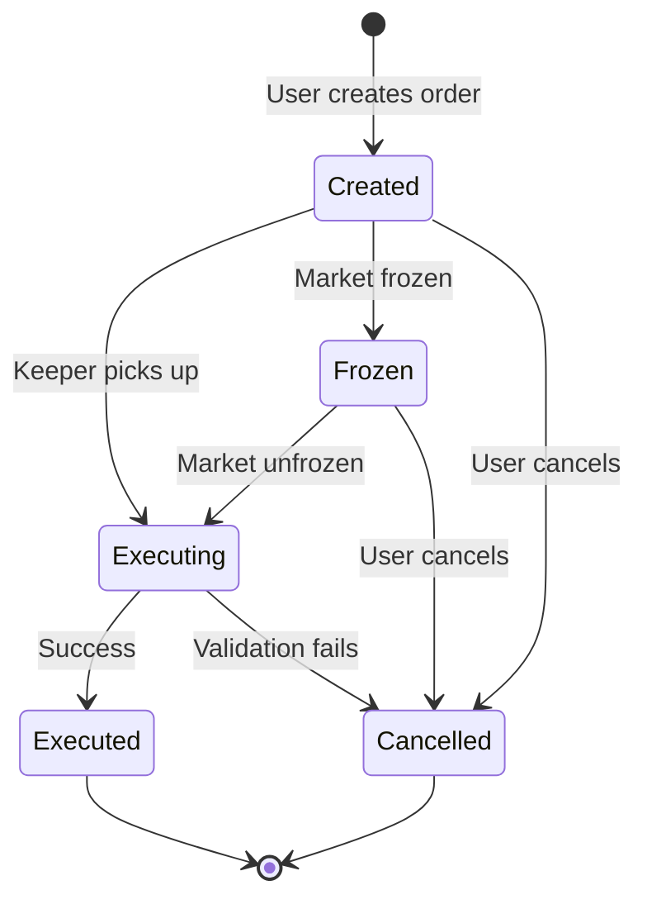

**Order Cancellation Reasons:**
- User-initiated cancellation
- Order validation failure (price out of range)
- Execution fee too low
- Market frozen
- Position validation failure
- Insufficient liquidity

**Code References:**
- `contracts/order/BaseOrderUtils.sol:287` - `cancelOrder()`
- `contracts/exchange/OrderHandler.sol:122` - Error handling

---

## Position Management

### Open Position (Market Increase)

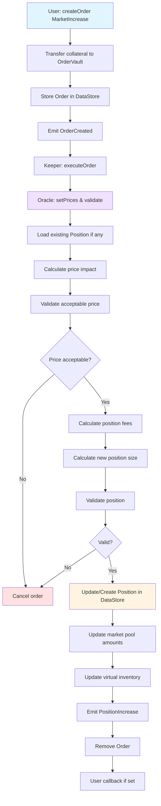

**Code References:**
- `contracts/order/IncreaseOrderUtils.sol:64` - `processOrder()`
- `contracts/position/IncreasePositionUtils.sol:58` - `increasePosition()`
- `contracts/pricing/PositionPricingUtils.sol:89` - `getPriceImpactUsd()`

**Key Calculations:**

```solidity
// contracts/position/IncreasePositionUtils.sol

// Calculate position size in tokens
sizeInTokens = sizeInUsd / executionPrice

// Calculate collateral after fees
collateralAmount = initialCollateral - positionFee - uiFee

// Update position
position.sizeInUsd += sizeInUsd
position.sizeInTokens += sizeInTokens
position.collateralAmount += collateralAmount
```

### Close Position (Market Decrease)

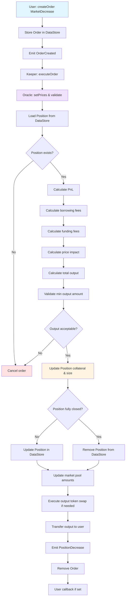

**Code References:**
- `contracts/order/DecreaseOrderUtils.sol:48` - `processOrder()`
- `contracts/position/DecreasePositionUtils.sol:77` - `decreasePosition()`
- `contracts/position/DecreasePositionCollateralUtils.sol:75` - `processCollateral()`
- `contracts/position/DecreasePositionSwapUtils.sol:28` - `swapWithdrawnCollateralToPnlToken()`

**PnL Calculation:**

```solidity
// contracts/position/PositionUtils.sol:199

// For Long Position
if (position.isLong) {
    priceDelta = executionPrice - position.entryPrice;
    pnl = position.sizeInTokens * priceDelta;
}

// For Short Position
if (!position.isLong) {
    priceDelta = position.entryPrice - executionPrice;
    pnl = position.sizeInTokens * priceDelta;
}

// Total output = collateral ± pnl - fees - priceImpact
```

### Position Data Flow

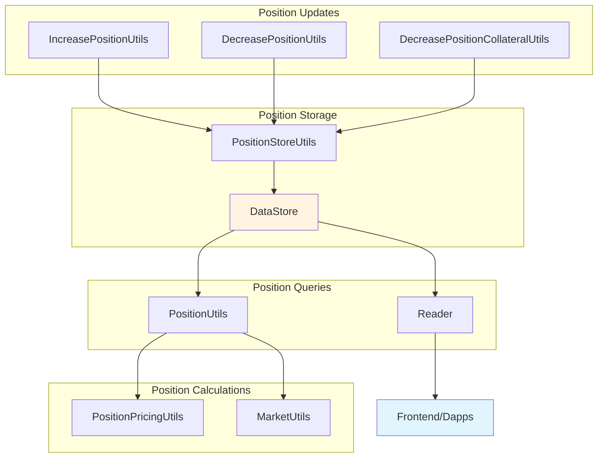

**Position Key Structure:**

```solidity
// contracts/position/PositionUtils.sol:35
function getPositionKey(
    address account,
    address market,
    address collateralToken,
    bool isLong
) internal pure returns (bytes32) {
    return keccak256(abi.encodePacked(
        account,
        market,
        collateralToken,
        isLong
    ));
}
```

**Code References:**
- `contracts/position/Position.sol:29` - Position data structure
- `contracts/position/PositionStoreUtils.sol:29` - Storage operations
- `contracts/position/PositionUtils.sol` - Core position logic

---

## Swap Operations

### Simple Swap Flow

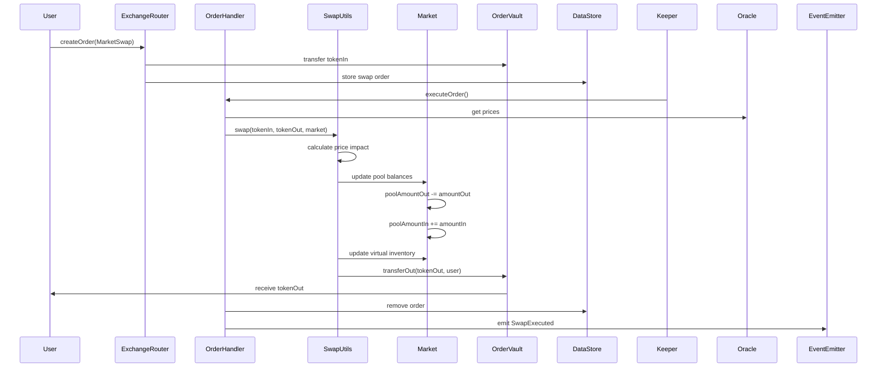

**Code References:**
- `contracts/swap/SwapUtils.sol:79` - `swap()`
- `contracts/pricing/SwapPricingUtils.sol:67` - `getPriceImpactUsd()`
- `contracts/order/SwapOrderUtils.sol:40` - `processOrder()`

### Multi-Hop Swap Flow

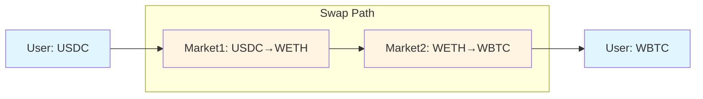

**Example Swap Path:**
```solidity
// Swap USDC → WBTC via ETH
address[] memory swapPath = new address[](2);
swapPath[0] = ethUsdMarket;  // USDC → WETH
swapPath[1] = btcUsdMarket;  // WETH → WBTC

createOrder({
    orderType: OrderType.MarketSwap,
    initialCollateralToken: USDC,
    swapPath: swapPath,
    // ...
});
```

**Code References:**
- `contracts/order/BaseOrderUtils.sol:473` - `getOutputToken()` (determines final token)
- `contracts/swap/SwapUtils.sol:79` - Iterates through swap path

### Swap Price Impact Calculation

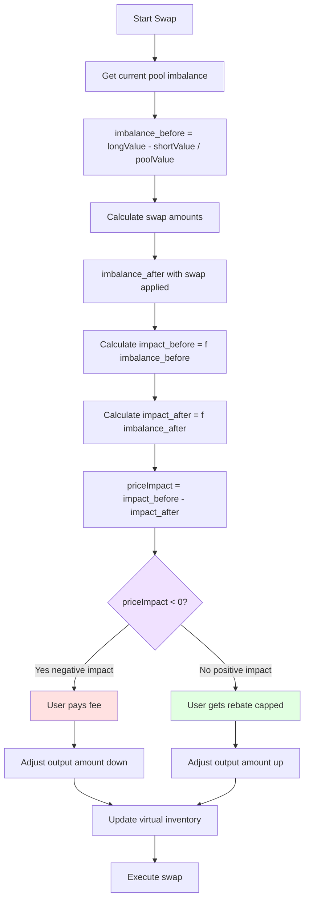

**Code References:**
- `contracts/pricing/SwapPricingUtils.sol:67` - `getPriceImpactUsd()`
- `contracts/market/MarketUtils.sol:1456` - Pool imbalance calculation
- `contracts/pricing/PricingUtils.sol:89` - Price impact formula

**Price Impact Formula:**

```solidity
// contracts/pricing/SwapPricingUtils.sol

// Calculate imbalance impact
function getPriceImpactUsd(params) returns (int256) {
    // Get pool value and imbalance
    (int256 impactUsd, int256 cappedImpactUsd) =
        _getPriceImpactUsd(params);

    // Positive impact (rebate) is capped
    if (impactUsd > 0) {
        return Math.min(impactUsd, cappedImpactUsd);
    }

    // Negative impact (fee) is not capped
    return impactUsd;
}
```

---

## Liquidations

### Liquidation Flow

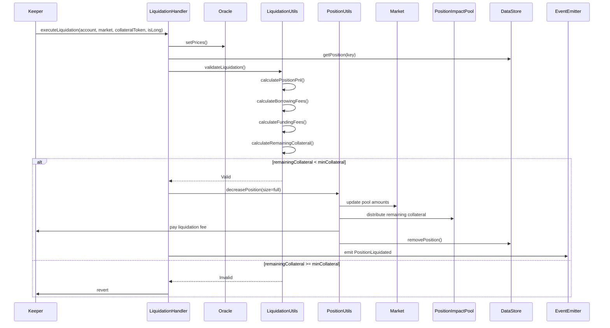

**Code References:**
- `contracts/exchange/LiquidationHandler.sol:46` - `executeLiquidation()`
- `contracts/liquidation/LiquidationUtils.sol:83` - `validateLiquidation()`
- `contracts/position/DecreasePositionUtils.sol` - Position close logic

### Liquidation Conditions

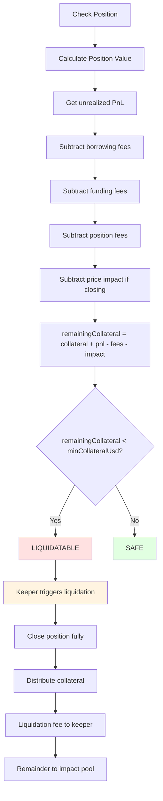

**Liquidation Calculations:**

```solidity
// contracts/liquidation/LiquidationUtils.sol:157

// Calculate if position is liquidatable
function validateLiquidation(
    Position.Props memory position,
    Market.Props memory market,
    MarketPrices prices
) internal view {
    // Get position PnL
    (int256 positionPnlUsd, , ) = PositionUtils.getPositionPnlUsd(
        dataStore,
        market,
        prices,
        position,
        sizeDeltaUsd // full size
    );

    // Calculate fees
    PositionPricingUtils.GetPositionFeesParams memory feesParams = ...;
    PositionPricingUtils.PositionFees memory fees =
        PositionPricingUtils.getPositionFees(feesParams);

    // Remaining collateral
    int256 remainingCollateralUsd =
        position.collateralAmount.toInt256()
        + positionPnlUsd
        - fees.totalCostAmount.toInt256();

    // Check if liquidatable
    if (remainingCollateralUsd < minCollateralUsd) {
        return; // Liquidatable
    }

    revert Errors.PositionShouldNotBeLiquidated();
}
```

**Code References:**
- `contracts/liquidation/LiquidationUtils.sol:157` - Validation logic
- `contracts/data/Keys.sol:1847` - `MIN_COLLATERAL_USD` key

---

## Auto-Deleveraging (ADL)

### ADL Trigger Flow

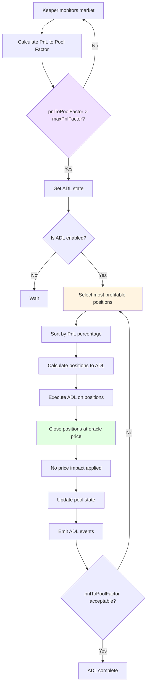

**Code References:**
- `contracts/adl/AdlUtils.sol:223` - `updateAdlState()`
- `contracts/adl/AdlUtils.sol:319` - `validateAdl()`
- `contracts/exchange/AdlHandler.sol:51` - `executeAdl()`

### ADL State Machine

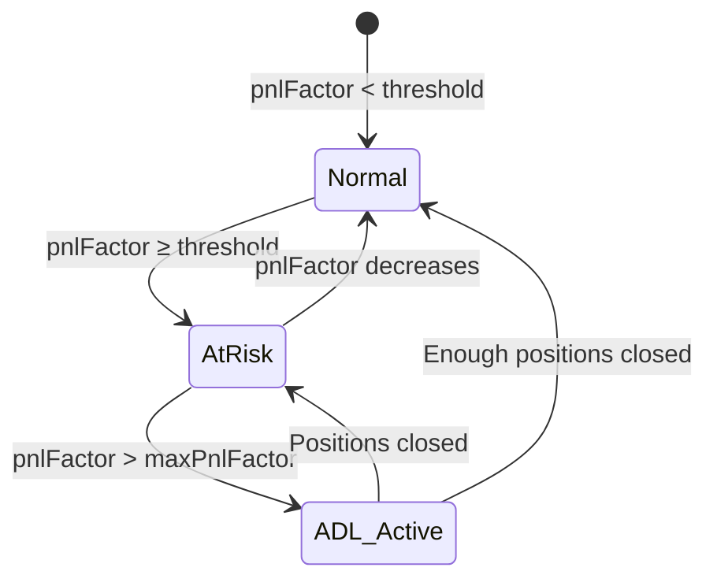

**ADL Conditions:**

```solidity
// contracts/adl/AdlUtils.sol

// Check if ADL should be triggered
function validateAdl(
    DataStore dataStore,
    address market,
    bool isLong,
    MarketPrices prices
) internal view {
    // Get max PnL factor for this market
    uint256 maxPnlFactor = MarketUtils.getMaxPnlFactor(
        dataStore,
        market,
        isLong
    );

    // Calculate current PnL to pool factor
    (int256 pnlToPoolFactor, ) = MarketUtils.getPnlToPoolFactor(
        dataStore,
        market,
        prices,
        isLong,
        true // maximize PnL
    );

    // Check if ADL needed
    if (pnlToPoolFactor < maxPnlFactor.toInt256()) {
        revert Errors.AdlNotRequired(pnlToPoolFactor, maxPnlFactor);
    }
}
```

### ADL Execution Details

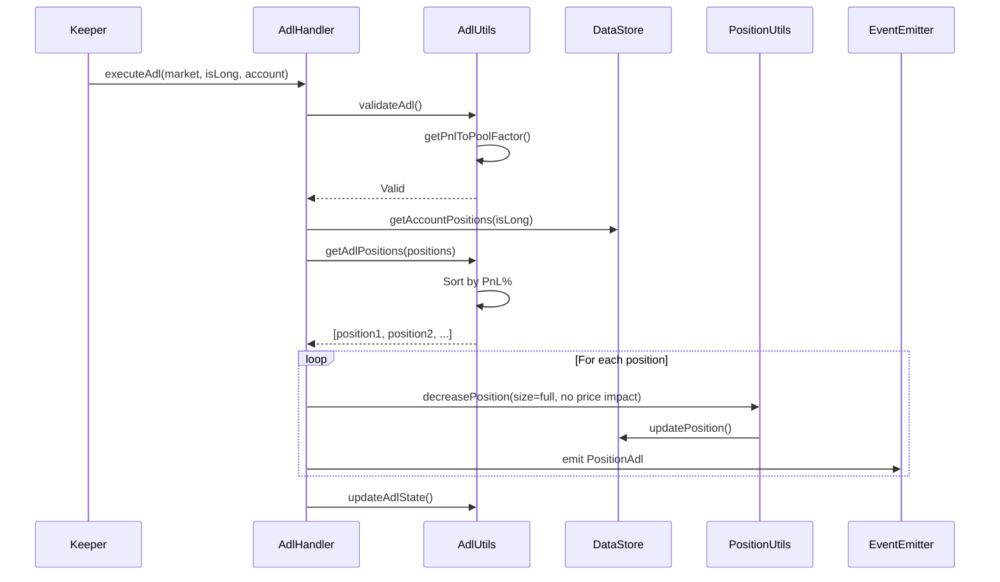

**ADL Position Selection:**

Positions selected for ADL based on:
1. **PnL Percentage** (highest first)
2. **Position Size** (larger positions prioritized)
3. **Time** (older positions may be prioritized)

**No Price Impact on ADL:**
- ADL positions closed at oracle price
- No price impact fees charged
- Fair to users being ADL'd
- Protects LP pool from excessive losses

**Code References:**
- `contracts/adl/AdlUtils.sol:77` - `createAdlOrder()`
- `contracts/position/DecreasePositionUtils.sol` - Close position logic (ADL path)

---

## Order Types Reference

### Market Orders vs Limit Orders

| Feature | Market Order | Limit Order |
|---------|-------------|-------------|
| Execution | Immediate (next keeper) | When price reaches trigger |
| Price | Current oracle price | User-specified trigger |
| Guarantee | Executes if liquidity available | May not execute |
| Use Case | Immediate entry/exit | Price targeting |

**Code References:**
- `contracts/order/Order.sol:95` - OrderType enum
- `contracts/order/BaseOrderUtils.sol:206` - Order type routing

### Order Validation

All orders validated for:
- Sufficient execution fee
- Valid market
- Acceptable price range (slippage protection)
- Position size limits
- Collateral requirements
- Market not frozen

**Code References:**
- `contracts/order/BaseOrderUtils.sol:564` - `validateNonEmptyOrder()`
- `contracts/order/OrderUtils.sol:178` - `validateOrderTriggerPrice()`

---

## Related Documentation

- **[ARCHITECTURE.md](./ARCHITECTURE.md)** - System architecture overview
- **[LIQUIDITY_FLOWS.md](./LIQUIDITY_FLOWS.md)** - Deposit and withdrawal flows
- **[PRICING_FLOWS.md](./PRICING_FLOWS.md)** - Pricing mechanisms
- **[COMPONENTS.md](./COMPONENTS.md)** - Contract reference

---

*Last Updated: 2025-12-01*
